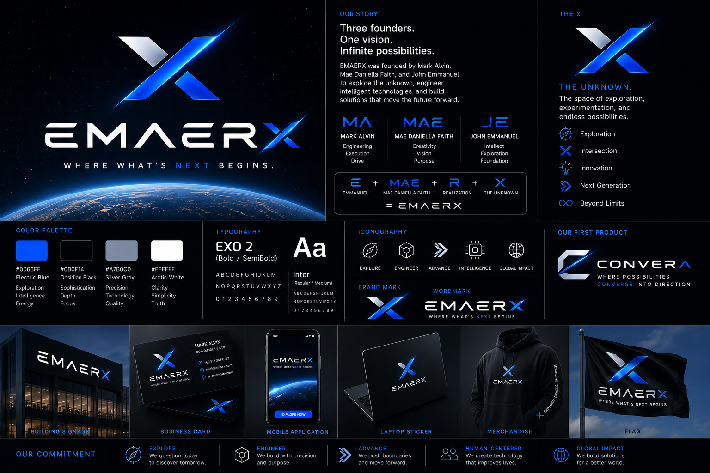

<div align="center">

  

  # CONVERA
  ### Evidence-Driven Project Intelligence and Multi-Methodology Validation System
  **A Flagship Product of EMAERX (v3.0)**

  *WHERE POSSIBILITIES CONVERGE INTO DIRECTION.*

  [](https://github.com/markalvincadangin/CONVERA/actions/workflows/ci.yml)
  [](LICENSE)
  [](docs/SRSDS.md)
  [](docs/frameworks/Computing%20Research%20Concept%20Development%20Framework.md)
  [](docs/frameworks/UIUX%20Design%20Framework.md)
  [](backend/)
  [](web/)
  [](backend/)
  [](backend/storage/)

  <p align="center">
    <strong>Transforms fragmented project ideas, research papers, AI-generated outputs, field observations, and user assumptions into structured, evidence-backed, methodology-governed, and decision-ready project opportunities.</strong>
  </p>

  <p align="center">
    <a href="#-quickstart-guide">Quickstart</a> •
    <a href="#-dual-governing-frameworks">Dual Frameworks</a> •
    <a href="#-system-architecture">Architecture</a> •
    <a href="#-key-features">Features</a> •
    <a href="docs/CONVERA_MASTER_ARCHITECTURE.md">Master Architecture</a> •
    <a href="docs/CONVERA_INTELLIGENCE_INTEGRATION_ARCHITECTURE.md">Intelligence (CIIA)</a> •
    <a href="docs/SRSDS.md">Technical Specs (SRSDS)</a>
  </p>

</div>

---

## 🧭 Executive Overview

Student technopreneurship teams, computing thesis candidates, and project innovators often generate ideas and unstructured data faster than they can organize, validate, and prove what is actually worth pursuing. Promising insights generated across AI chats, group chats, literature reviews, spreadsheets, and field notes are frequently lost, misdirected, or debated without empirical backing.

**CONVERA** bridges the **problem-to-decision gap** through a closed-loop epistemic ratcheting engine:

- **From:** *"I think this is a good idea."*
- **To:** *"We have empirical field evidence, dual-literature grounding, isolated scholarly gaps, and structured requirements proving this problem is worth solving."*

---

## 🏛️ Dual Governing Frameworks

CONVERA provides first-class, dynamic methodology governance tailored to the specific problem-solving paradigm of the active workspace:

```text
┌──────────────────────────────────────────────────────────────────────────────────────────────────┐
│                                   DYNAMIC COMMAND DECK TRACKS                                    │
├──────────────────────────────────────────────────────────────────────────────────────────────────┤
│ 🚀 INNOVATION & TECHNOPRENEURSHIP TRACK (7 Slots / 2 Gates):                                     │
│ [0: Problem Bank] → [1: Discovery] → [2: Screening (G1)] → [3: Validation (G2)] →               │
│ [4: Ideation] → [5: MVP Audit] → [6: Studio: Venture Hub]                                        │
├──────────────────────────────────────────────────────────────────────────────────────────────────┤
│ 🔬 COMPUTING RESEARCH DSR TRACK (8 Slots / 4 Gates):                                             │
│ [0: Problem Bank] → [1: Stage A (Scouting)] → [2: Stage B (Validation G1)] →                     │
│ [3: Stage C (Opportunity G2)] → [4: Stage D (Formulation)] → [5: Stage E (Evaluation G3)] →      │
│ [6: Stage F (Feasibility G4)] → [7: Studio: Proposal Suite]                                      │
└──────────────────────────────────────────────────────────────────────────────────────────────────┘
```

### 1. Venture Innovation Pipeline
Governed by [`Evidence-Ratcheted Problem-to-Solution Pipeline Framework.md`](docs/frameworks/Evidence-Ratcheted%20Problem-to-Solution%20Pipeline%20Framework.md):
- **Phase 1: Regional Problem Landscape Discovery** (Agriculture, Healthcare, MSME, Governance).
- **Phase 2: Problem Screening & Sizing Matrix** (`Gate 1: Opportunity Worthiness`).
- **Phase 3: Socratic Mom Test Validation Clinic** (`Gate 2: Empirical Validation`).
- **Phase 4: Mechanism Ideation & Solution Validation Board (SVB)**.
- **Phase 5: MVP Validation & Skin-in-the-Game Commitment Audit**.

### 2. Computing Research Concept Development (Academic DSR / CRCDP)
Governed by [`Computing Research Concept Development Framework.md`](docs/frameworks/Computing%20Research%20Concept%20Development%20Framework.md):
- **Stage A: Problem Discovery & Scouting Mechanism** (Bordens & Abbott).
- **Stage B: Problem Validation & Grounding** (`Gate 1: Problem Significance`).
- **Stage C: Research Opportunity & Gap Matrix** (`Gate 2: Research Gap Quality`).
- **Stage D: Solution Formulation & 4 DSR Artifact Classes** (Constructs, Models, Methods, Instantiations — March & Smith).
- **Stage E: Trapping & Evaluation Design** (`Gate 3: Evaluation Rigor & Circumscription`).
- **Stage F: Relevance, Ethics & Proposal Readiness** (`Gate 4: Proposal Readiness` — DOST-PCIEERD / SDGs / RA 10173).

---

## ⚡ Key Platform Features

| Capability | Description |
| :--- | :--- |
| **Unified Command Deck** | 100% dynamic top stepper that automatically adapts its slots (7 vs 8) and directly mounts the active stage with zero nested sub-buttons. |
| **Global Command Palette (`Ctrl+K`)** | Obsidian-grade spotlight launcher to jump instantly to any phase, search problem records (`AGR-004`), or trigger AI tools. |
| **Adaptive Deliverables Studio** | Multi-methodology output hub generating **9-Box Lean Canvases, SWOT, Pitch Decks, IEEE 830 SRS**, or **IMRaD DSR Proposals, LaTeX Matrices & BibTeX**. |
| **Interactive Literature Matrix** | Live search against OpenAlex & EuropePMC with gap-to-study cross-filtering and 1-click Overleaf LaTeX table export. |
| **Intelligence Scorecard HUD** | 4-Pillar confidence simulation with Monte Carlo sensitivity modeling. |
| **Requirements Lineage Graph** | Full epistemic traceability mapping problems $	o$ evidence claims $	o$ assumptions $	o$ software requirements. |
| **5-Rule Methodology Governance** | Isolated progress tracking with snapshot preservation during framework switches. |

---

## 🏗️ System Architecture

```text
CONVERA PLATFORM
│
├── ACTIVE WORKSPACE
│     ├── Active Methodology Framework (Innovation vs Research)
│     ├── Quality Gate Status (Passed, Blocked, Evaluated)
│     └── Active Session State & Snapshot Rollbacks
│
├── CANONICAL PROBLEM BANK (Persistent Knowledge Asset)
│     ├── 4-Claim Evidence Ledgers (Friction, Frequency, Workaround, Commitment)
│     ├── Sufferer Archetype & Quantified Economic Loss
│     └── Academic DOI Grounding & Literature Citations
│
├── CORE BACKEND ENGINES (Python 3.12 / FastAPI)
│     ├── Socratic Mom Test Interrogator
│     ├── Literature Harvester (OpenAlex, Crossref, Europe PMC)
│     ├── Circumscription & Artifact Evaluator
│     ├── Requirements Traceability Engine
│     └── Monte Carlo Scorecard Engine
│
└── FRONTEND INTERACTION LAYER (Next.js 15 / React 19 / Tailwind CSS v4)
      ├── Unified Command Deck (PipelineStepper.tsx)
      ├── Global Command Palette (CommandPaletteModal.tsx - Ctrl+K)
      ├── Adaptive Deliverables Studio (DeliverablesStudio.tsx)
      └── Motion Physics Layer (Framer Motion)
```

---

## 🚀 Quickstart Guide

### Prerequisites
- **Python 3.11+** (Python 3.12 recommended)
- **Node.js 18+** (Node.js 20+ recommended)
- **Git**

### 1. Clone the Repository
```bash
git clone https://github.com/markalvincadangin/CONVERA.git
cd CONVERA
```

### 2. Setup and Launch Backend
```bash
# Create and activate virtual environment
python -m venv venv

# Windows (PowerShell)
.\venv\Scripts\Activate.ps1
# Linux / macOS
source venv/bin/activate

# Install dependencies
pip install -r backend/requirements.txt

# Launch FastAPI Server
python backend/main.py
```
*Backend runs live at `http://localhost:8000` (Swagger UI at `http://localhost:8000/docs`).*

### 3. Setup and Launch Frontend
```bash
cd web

# Install dependencies
npm install

# Start Next.js Development Server
npm run dev
```
*Frontend runs live at `http://localhost:3000`.*

---

## 🧪 Testing & Verification

Run the full hermetic backend test suite:
```bash
pytest backend/tests/ -q
```
*Expected result: `81 passed` (100% Hermetic Pass).*

Run frontend type-checking:
```bash
cd web
npx tsc --noEmit
```
*Expected result: `0 errors` (100% Type-Safe Pass).*

---

## 📄 License & Attribution

CONVERA is licensed under the [MIT License](LICENSE).  
Designed and engineered by **EMAERX** in collaboration with regional computing, agriculture, and technopreneurship stakeholders.
