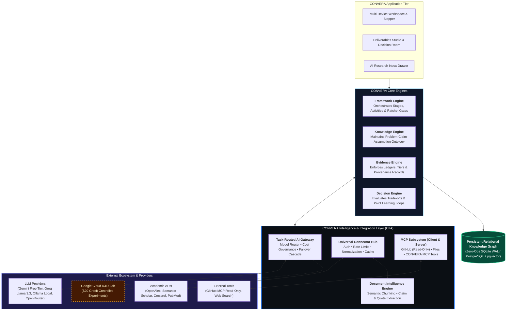
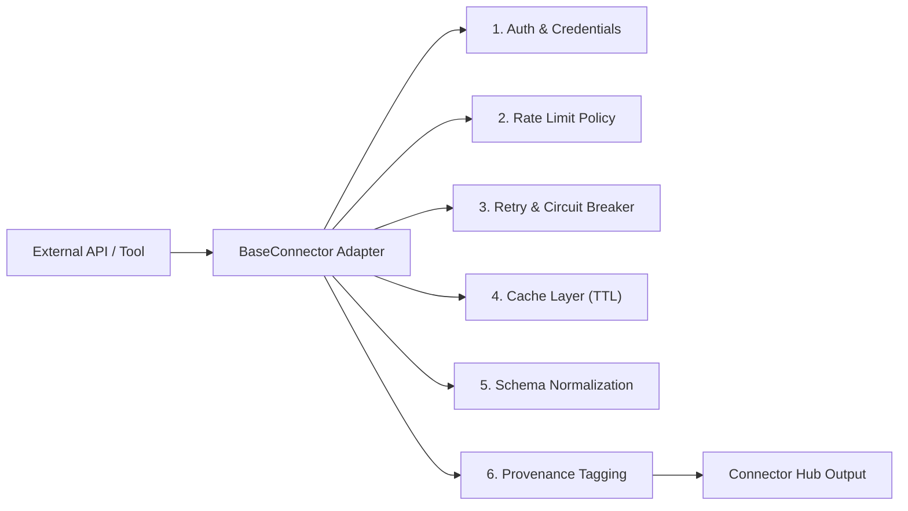
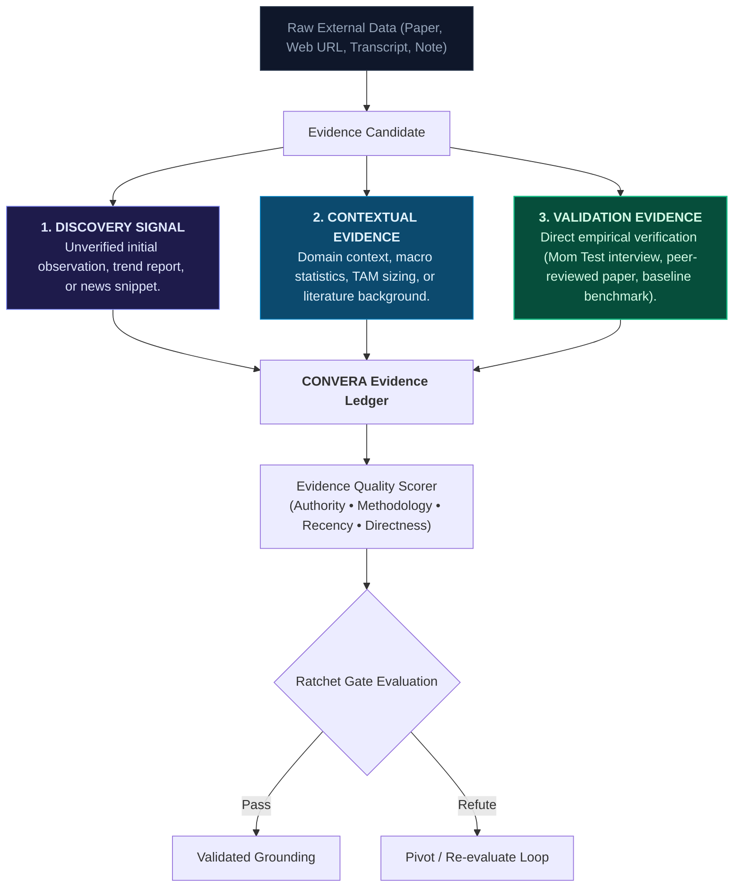
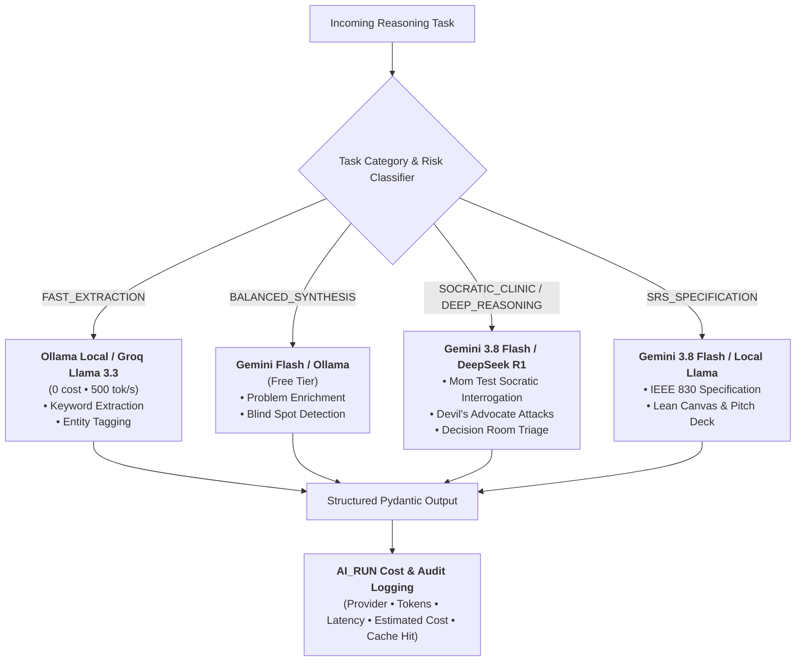
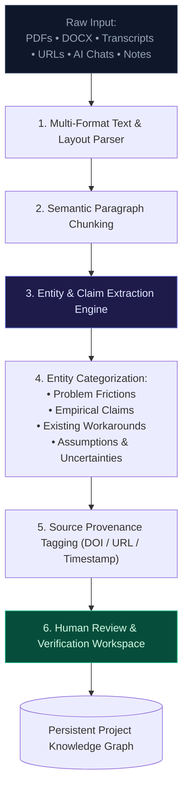
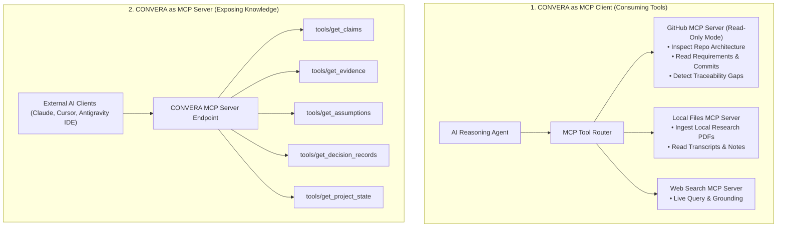

# CONVERA Intelligence & Integration Architecture (CIIA)

**Product:** CONVERA  
**Parent Brand:** EMAERX  
**Standard Alignment:** CONVERA Concept Development Standard (CCDS) • Model Context Protocol (MCP) • IEEE 830 / ISO 29148  
**Document Type:** Technical Systems, Integration Contract & Experimental Cloud R&D Specification  
**Status:** Approved / Implementation Baseline  
**Version:** 1.0  

---

## 1. Executive Summary & Core Doctrine

The **CONVERA Intelligence & Integration Architecture (CIIA)** defines the formal architectural contract between the **CONVERA Core System** (Knowledge, Evidence, Framework, and Decision Engines) and the external intelligence ecosystem (Large Language Models, Academic APIs, Web Search, Document Parsers, MCP Tooling, and Cloud Accelerators).

CIIA is governed by two foundational doctrines:

> ### **Doctrine I: "External systems provide information and capabilities; CONVERA provides the persistent context, evidence structure, governance, and decision intelligence."**

> ### **Doctrine II: Free-First Sovereign Core + Controlled Cloud Acceleration.**  
> *Build CONVERA's core as a ₱0, provider-independent sovereign platform, while using experimental cloud credits ($20 Google Cloud credits) as a strictly bounded R&D laboratory to determine which cloud-managed capabilities provide empirical value over local baselines.*

```text
CONVERA CORE (₱0 Required Baseline)
       │
┌──────┴─────────────────────────────────┐
│ LOCAL FREE FIRST                       │  GOOGLE CLOUD R&D ($20 Credits)
│ • Ollama (100% Local / Private)        │  • Agent Platform Benchmark
│ • Gemini Developer API (Free Tier)     │  • Agent Garden Pattern Mining
│ • SQLite WAL / PostgreSQL + pgvector   │  • Cloud Vertex RAG vs pgvector
│ • OpenAlex, S2, Crossref (Free Public) │  • Comparative Latency / Cost Benchmark
└────────────────────────────────────────┘
```

---

## 2. System Architecture & Boundaries



---

## 3. Universal Connector Contract (`BaseConnector`)

Every external data source, academic index, or search engine implements the `BaseConnector` interface:



### 3.1 Connector Specification
- **`connector_id`**: Unique string identifier (`openalex`, `semantic_scholar`, `crossref`, `pubmed`).
- **`capabilities`**: Declared feature list (`SEARCH`, `FETCH_BY_ID`, `CITATIONS`, `TOPICS`, `PROVENANCE`).
- **`auth_type`**: `NONE`, `API_KEY`, `BEARER_TOKEN`, or `OAUTH2`.
- **`rate_limit_policy`**: Maximum requests per second, concurrency limit, and exponential backoff envelope.
- **`cache_ttl_seconds`**: Time-to-live for caching static metadata (default: 3600s).
- **`health_check()`**: Returns ping latency, status code, and operational availability.

---

## 4. Evidence Ingestion & Epistemic Taxonomy

CIIA strictly isolates **AI generation** from **Empirical evidence**:



### 4.1 Invariant: AI Confidence $
eq$ Empirical Evidence Strength
- **AI Claim Confidence (0.00 – 1.00):** The model's statistical extraction certainty.
- **Empirical Evidence Strength (`WEAK` | `MODERATE` | `STRONG` | `CONTRADICTED`):** The real-world evidentiary rigor based on primary source authority, sample size, methodology, and directness.

---

## 5. Task-Based AI Gateway & Cost Governance



---

## 6. Document Intelligence & Research Inbox Pipeline



---

## 7. Model Context Protocol (MCP) Architecture

CONVERA operates as both an **MCP Client** and an **MCP Server**:



---

## 8. Google Cloud Experimental Integration & Credit Governance

To balance **zero-cost sovereign independence** with **rapid technological acceleration**, CONVERA establishes a controlled Google Cloud R&D protocol governed by the **$20 Experimental Credit Budget**.

```text
                       CONVERA R&D STRATEGY
                       
        FREE BASELINE (₱0)                   CLOUD EXPERIMENTS ($20)
     ┌───────────────────────┐            ┌───────────────────────────┐
     │ Ollama Local          │            │ Google Agent Platform     │
     │ Gemini Free API Tier  │ vs. Target │ Vertex AI Search / RAG    │
     │ SQLite WAL / pgvector │            │ Agent Garden Patterns     │
     └───────────────────────┘            └───────────────────────────┘
                 │                                      │
                 └──────────────────┬───────────────────┘
                                    ▼
                     EVIDENCE-BASED EVALUATION GATE
               (Precision • Recall • Latency • Cost ROI)
                                    │
                  ┌─────────────────┴─────────────────┐
                  ▼                                   ▼
          EMPIRICALLY SUPERIOR?               MARGINAL / OVERPRICED?
         (Adopt as optional adapter)        (Keep ₱0 Free Core baseline)
```

### 8.1 $20 Credit Safety Allocation Matrix

| Allocation Category | Budget Cap | Primary Objective | Safety Kill Threshold |
|---|---|---|---|
| **Safety & Setup Validation** | **$2.00** | Test Spend-Cap, Billing API telemetry, and Cloud IAM boundaries | > $1.50 |
| **Agent Platform & ADK Experiment** | **$4.00** | Benchmark Google-managed agent infrastructure vs. CONVERA native routing | > $3.50 |
| **Agent Garden Pattern Mining** | **$4.00** | Inspect architectural patterns for RAG, multi-agent coordination, and MCP | > $3.50 |
| **Vertex RAG vs pgvector Benchmark** | **$4.00** | Evaluate retrieval precision, citation accuracy, and hallucination rate | > $3.50 |
| **Model Quality & Reasoning Evaluation** | **$3.00** | Head-to-head reasoning audit on complex Mom Test & IEEE 830 scenarios | > $2.50 |
| **High-Value Contingency Reserve** | **$3.00** | Reserved for breakthrough experiments or final re-verification | > $2.50 |
| **TOTAL EXPERIMENTAL BUDGET** | **$20.00** | **Strict Hard Spend-Cap Enabled in Google Cloud Billing** | **100% Hard Stop** |

### 8.2 The Four Controlled Cloud Experiments

#### Experiment A: Google Agent Platform vs. Native CIIA Agent Architecture
- **Hypothesis:** Does Google-managed agent orchestration provide superior state management, latency, or tool integration over CONVERA's native asyncio task routing?
- **Metric:** Latency (ms), Execution reliability (%), Development maintenance overhead, and token cost per reasoning cycle.

#### Experiment B: Agent Garden Architectural Pattern Mining
- **Principle:** Agent Garden is a **pattern library and accelerator**, never a vendor lock-in dependency.
- **Process:** Inspect reference architectures in Agent Garden $	o$ Extract reusable prompt/agent patterns $	o$ Port to provider-agnostic CIIA connectors.

#### Experiment C: Google Vertex RAG vs. CONVERA PostgreSQL pgvector
- **Hypothesis:** Does Vertex AI Search justify recurring cloud costs over a local, free PostgreSQL + pgvector cluster?
- **Metrics Evaluated:**
  1. *Retrieval Precision & Recall* on 100 benchmark research papers.
  2. *Citation Accuracy* (zero hallucinated DOIs).
  3. *Query Latency & Financial Cost per 1,000 Queries*.

#### Experiment D: Cloud Frontier Model vs. Local/Free Model Benchmark
- **Hypothesis:** Identify the exact threshold where free models (Groq Llama 3.3, Gemini Free Tier, Ollama) match or underperform frontier paid models in Socratic Mom Test challenging and IEEE 830 requirement generation.

---

## 9. Complete 9-Phase Implementation Sequence

```mermaid
graph TD
    P1["<b>Phase 1: Architecture</b><br/>• Freeze Domain Contracts<br/>• CIIA v1.0 Spec<br/>• Epistemic Ingestion Rules"]
    P2["<b>Phase 2: Core Foundation</b><br/>• SQLite WAL / PostgreSQL<br/>• pgvector Setup<br/>• Knowledge Graph & Evidence Ledger"]
    P3["<b>Phase 3: CIIA Connectors</b><br/>• Task-Routed AI Gateway<br/>• OpenAlex, S2, Crossref<br/>• BaseConnector Contract"]
    P4["<b>Phase 4: Document Intelligence</b><br/>• Document Parser Engine<br/>• AI Research Inbox<br/>• Duplicate Detection"]
    P5["<b>Phase 5: Intelligent Agents</b><br/>• Research Agent<br/>• Socratic Mom Test Critic<br/>• Citation Verifier"]
    P6["<b>Phase 6: Multi-Frameworks</b><br/>• Research Framework (CRCDP)<br/>• Innovation (5-Phase Ratchet)<br/>• Capstone & Product"]
    P7["<b>Phase 7: Decision Room</b><br/>• Decision Room Triage<br/>• Assumption Radar<br/>• SRS & Artifact Studio"]
    P8["<b>Phase 8: Cloud R&D ($20)</b><br/>• Agent Platform Experiment<br/>• Vertex RAG Benchmark<br/>• Model Evaluation"]
    P9["<b>Phase 9: Architectural Decision</b><br/>• Evidence-Based Adapter Decisions<br/>• Freeze Sovereign Production Release"]

    P1 --> P2 --> P3 --> P4 --> P5 --> P6 --> P7 --> P8 --> P9

    style P1 fill:#0f172a,stroke:#38bdf8,color:#f8fafc
    style P2 fill:#0f172a,stroke:#38bdf8,color:#f8fafc
    style P3 fill:#0f172a,stroke:#38bdf8,color:#f8fafc
    style P4 fill:#0066ff,stroke:#60a5fa,stroke-width:2px,color:#ffffff
    style P5 fill:#0f172a,stroke:#38bdf8,color:#f8fafc
    style P6 fill:#0f172a,stroke:#38bdf8,color:#f8fafc
    style P7 fill:#0f172a,stroke:#38bdf8,color:#f8fafc
    style P8 fill:#451a03,stroke:#f59e0b,color:#fef3c7
    style P9 fill:#064e3b,stroke:#34d399,stroke-width:2px,color:#ffffff
```



---

## 10. Document Governance & Status

- **Document Identifier:** `CIIA-SPEC-v1.0`
- **Governing Standard:** CONVERA Concept Development Standard (CCDS v1.0)
- **Primary Authors:** Mark Alvin, Mae Daniella Faith, John Emmanuel (EMAERX)
- **Status:** Active Implementation Baseline
- **Last Updated:** September 3, 2026
