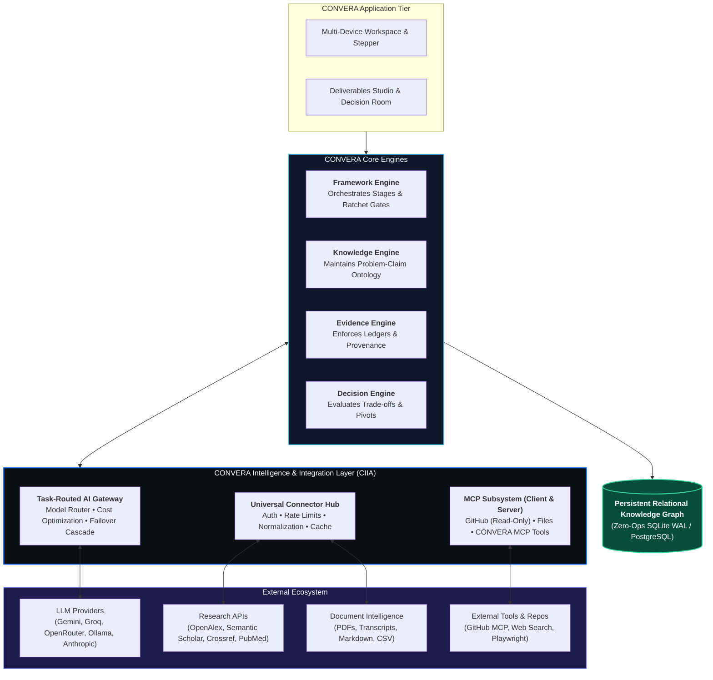
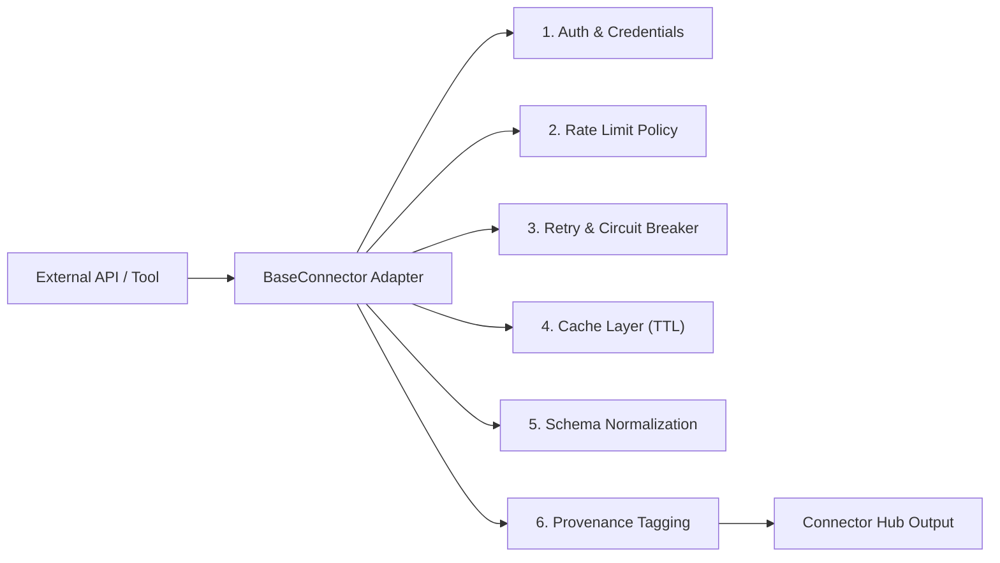
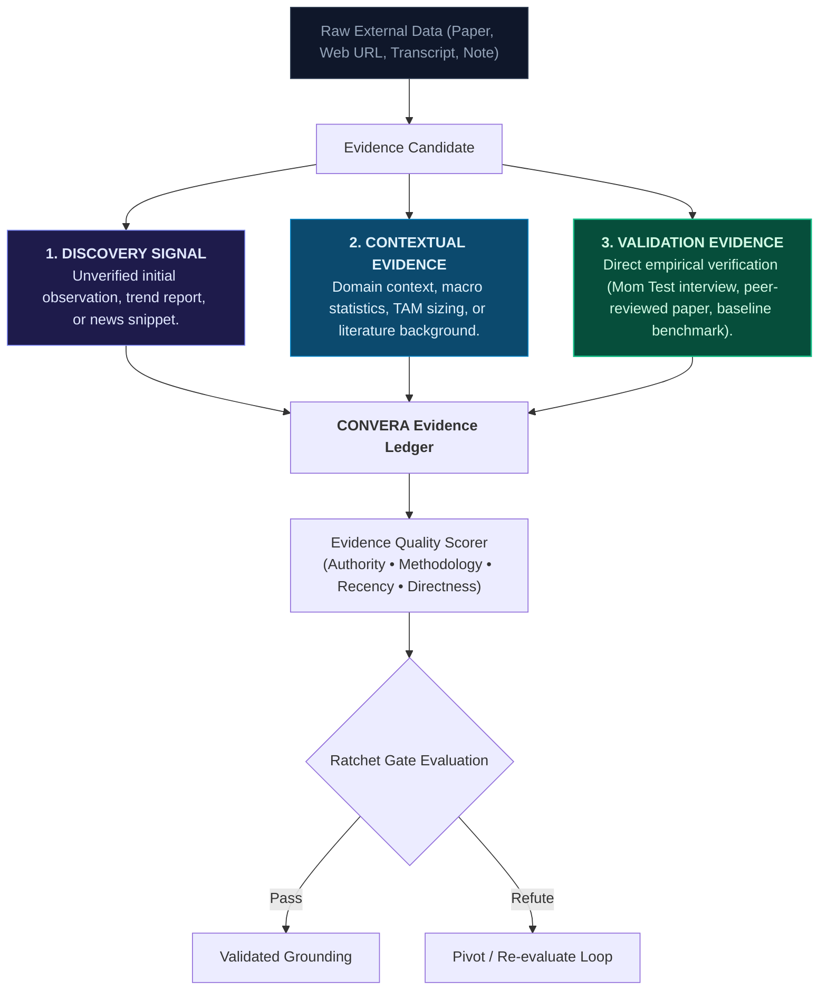
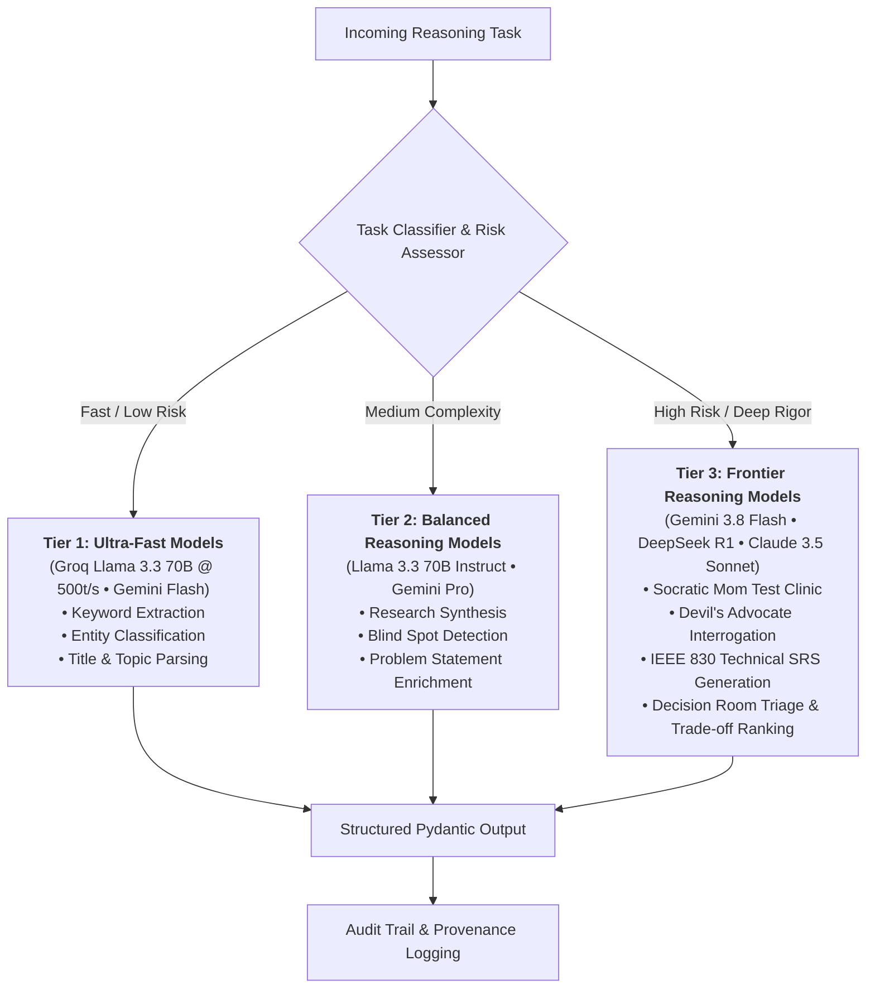
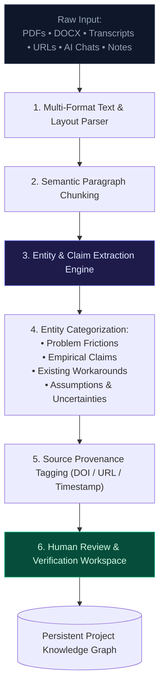
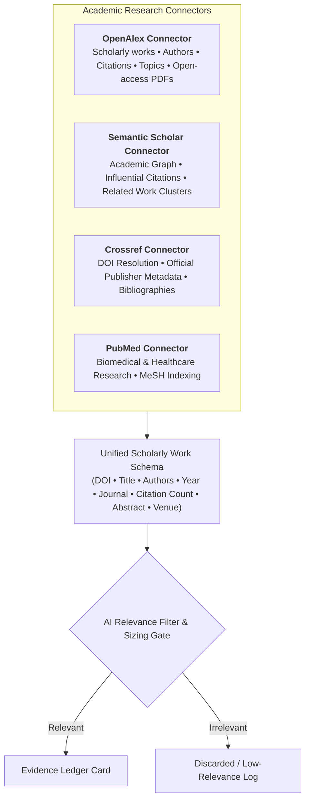
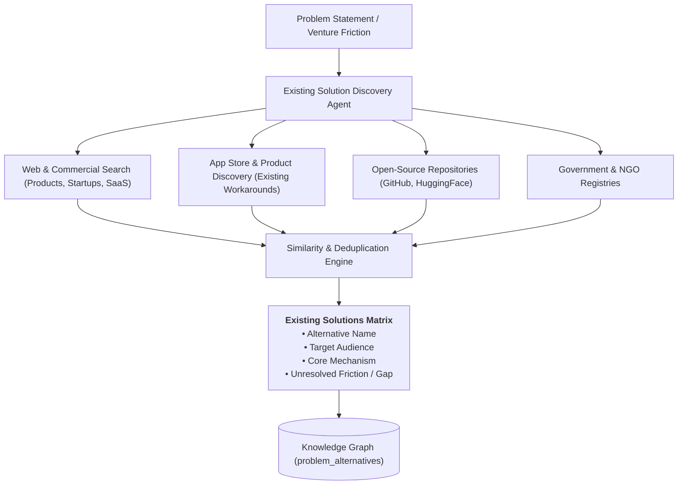
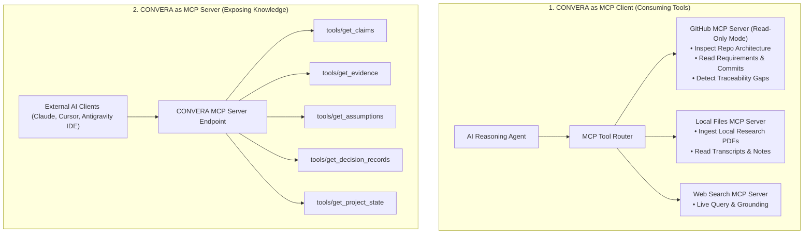
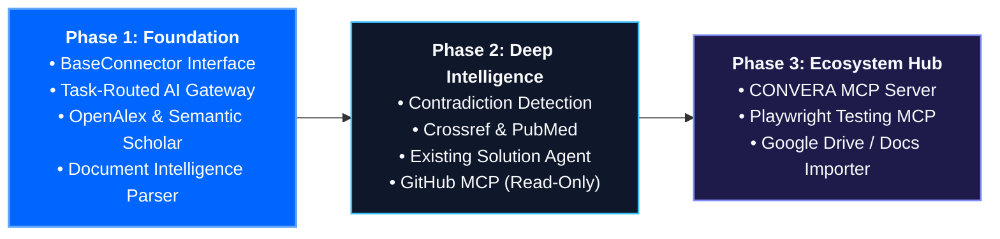

# CONVERA Intelligence & Integration Architecture (CIIA)

**Product:** CONVERA  
**Parent Brand:** EMAERX  
**Standard Alignment:** CONVERA Concept Development Standard (CCDS) • Model Context Protocol (MCP) • IEEE 830 / ISO 29148  
**Document Type:** Technical Systems & Architectural Integration Contract  
**Status:** Approved / Implementation Baseline  
**Version:** 1.0  

---

## 1. Executive Summary & Core Doctrine

The **CONVERA Intelligence & Integration Architecture (CIIA)** defines the formal architectural contract between the **CONVERA Core System** (Knowledge, Evidence, Framework, and Decision Engines) and the external intelligence ecosystem (Large Language Models, Academic APIs, Web Search, Document Parsers, and MCP Tooling).

CIIA is governed by one non-negotiable architectural doctrine:

> ### **"External systems provide information and capabilities; CONVERA provides the persistent context, evidence structure, governance, and decision intelligence."**

Under this doctrine:
1. **AI models are reasoning engines, not authorities.** Consequential venture, research, and technical decisions are made by human founders and researchers.
2. **Search and API results are evidence candidates, not automatic facts.** All ingested signals undergo provenance tracking and quality scoring before becoming validated evidence.
3. **Connectors are decoupled from methodologies.** A scholarly paper, a competitor URL, a user interview, or a GitHub repository is represented within a uniform knowledge graph regardless of whether the active framework is *Research*, *Innovation*, *Product*, or *Capstone*.

---

## 2. System Architecture & Boundaries



---

## 3. Universal Connector Contract (`BaseConnector`)

Every external data source, API, or discovery tool must implement the `BaseConnector` interface. No engine may make raw, unmediated HTTP requests.



### 3.1 Connector Specification
Each connector must declare:
- **`connector_id`**: Unique string identifier (e.g. `openalex`, `semantic_scholar`, `github_mcp`).
- **`capabilities`**: Declared feature list (`SEARCH`, `FETCH_BY_ID`, `CITATIONS`, `AUTHOR_GRAPH`, `FULL_TEXT`).
- **`auth_type`**: `NONE`, `API_KEY`, `BEARER_TOKEN`, or `OAUTH2`.
- **`rate_limit_policy`**: Maximum requests per second, concurrency limit, and exponential backoff envelope.
- **`cache_ttl_seconds`**: Time-to-live for caching static metadata.
- **`health_check()`**: Returns ping latency, quota remaining, and service availability.

---

## 4. Evidence Ingestion & Epistemic Tiers

CIIA enforces the **CCDS Epistemic Taxonomy**, preventing unverified claims from masquerading as empirical facts.



### 4.1 Invariant: AI Confidence $
eq$ Empirical Evidence Strength
- **AI Claim Confidence (0.00 – 1.00):** The model's statistical certainty that it extracted the text correctly.
- **Empirical Evidence Strength (`WEAK` | `MODERATE` | `STRONG` | `CONTRADICTED`):** The real-world evidentiary rigor based on primary source authority, sample size, methodology, and directness.

---

## 5. Task-Based AI Gateway & Cost Optimization

Rather than hardcoding calls to a single expensive model, the **CONVERA AI Gateway** dynamically routes tasks based on cognitive complexity and risk:



### 5.1 Routing Matrix

| Task Category | Minimum Reasoning | Default Provider | Fallback Provider | Max Latency |
|---|---|---|---|---|
| Keyword Extraction | Fast | Groq (Llama 3.3) | Gemini Flash | < 300ms |
| Entity & Claim Parsing | Fast | Gemini Flash | Groq (Llama 3.3) | < 500ms |
| Literature Relevance Gate | Medium | Gemini Flash | OpenRouter | < 1.0s |
| Socratic Mom Test | High Reasoning | Gemini 3.8 Flash | Groq (Llama 3.3) | < 2.0s |
| Devil's Advocate Challenge | High Reasoning | Gemini 3.8 Flash | OpenRouter | < 2.5s |
| Decision Room AI Judge | Highest Rigor | Gemini 3.8 Flash | OpenRouter | < 3.0s |
| IEEE 830 SRS Generation | Highest Rigor | Gemini 3.8 Flash | Local Ollama | < 4.0s |

---

## 6. Document Intelligence & Research Inbox Pipeline

To fulfill the core philosophy (*"Don't make the user organize the information for the system"*), the Research Inbox converts raw multi-modal dumps into structured knowledge:



---

## 7. Research Connector Subsystem

CIIA integrates academic and scholarly knowledge providers under a unified schema:



---

## 8. Web & Existing Solution Intelligence

To prevent student and research teams from reinventing existing systems, the **Existing Solution Agent** benchmarks external alternatives:



---

## 9. Model Context Protocol (MCP) Architecture

CONVERA implements a **Bidirectional MCP Subsystem** operating as both an **MCP Client** and an **MCP Server**:



---

## 10. Security, Isolation & Secret Governance

1. **Read-Only by Default:** All tool connectors (GitHub, Filesystem) operate under strict read-only execution. No arbitrary external code modifications or file deletions are permitted.
2. **Explicit Capability Grants:** External tools must be explicitly allowlisted per project room.
3. **Secret Isolation:** API keys (Gemini, Groq, OpenRouter, GitHub Tokens) are isolated in backend environment variables and never exposed to client-side code.
4. **Audit Logging:** Every AI execution, tool call, and connector request is logged in the `ai_runs` and `audit_events` tables.

---

## 11. Data Provenance & Traceability Model

Every output in CONVERA maintains an unbroken chain of custody:

```text
PRIMARY SOURCE (Paper DOI, Interview Audio, Official Dataset, Web URL)
       v
RAW INGESTION MATERIAL
       v
EXTRACTED CLAIM (Friction, Frequency, Dissatisfaction, Commitment)
       v
EVIDENCE LEDGER CARD (Scored & Grounded)
       v
NAMED ASSUMPTION (Prioritized Risk Tier)
       v
VALIDATION TEST & MOM TEST RESULT
       v
IMMUTABLE DECISION RECORD (Rationale & Rejected Alternatives)
       v
TECHNICAL ARTIFACT (IEEE 830 SRS Spec, Lean Canvas, Pitch Deck)
```

---

## 12. Phased Implementation Roadmap



---

## 13. Formal Implementation Interface Contracts

### 13.1 `BaseConnector` (Python Interface)
```python
from abc import ABC, abstractmethod
from typing import Dict, List, Optional, Any
from pydantic import BaseModel

class ProvenanceMetadata(BaseModel):
    source_name: str
    source_url: Optional[str] = None
    doi: Optional[str] = None
    retrieval_timestamp: str
    authority_tier: str = "PEER_REVIEWED"  # PEER_REVIEWED, OFFICIAL_DATA, FIELD_INTERVIEW, WEB_SIGNAL

class NormalizedScholarlyWork(BaseModel):
    doi: Optional[str]
    title: str
    authors: List[str]
    year: Optional[int]
    venue: Optional[str]
    citation_count: int = 0
    abstract: Optional[str]
    url: Optional[str]
    open_access_pdf_url: Optional[str]
    provenance: ProvenanceMetadata

class BaseConnector(ABC):
    @property
    @abstractmethod
    def connector_id(self) -> str:
        pass

    @abstractmethod
    async def search(self, query: str, limit: int = 10, **kwargs) -> List[NormalizedScholarlyWork]:
        pass

    @abstractmethod
    async def fetch_by_id(self, identifier: str) -> Optional[NormalizedScholarlyWork]:
        pass

    @abstractmethod
    async def health_check(self) -> Dict[str, Any]:
        pass
```

### 13.2 `EvidenceCandidate` (Python & TypeScript Schema)
```python
class EvidenceCandidate(BaseModel):
    id: str
    problem_id: str
    claim_text: str
    claim_type: str  # FRICTION_REALITY, FREQUENCY_CONSEQUENCE, WORKAROUND_DISSATISFACTION, ADOPTION_COMMITMENT
    evidence_tier: str  # DISCOVERY_SIGNAL, CONTEXTUAL_EVIDENCE, VALIDATION_EVIDENCE
    evidence_strength: str  # WEAK, MODERATE, STRONG, CONTRADICTED
    ai_confidence: float = Field(ge=0.0, le=1.0)
    supporting_quote: Optional[str]
    provenance: ProvenanceMetadata
    status: str = "PENDING_REVIEW"  # PENDING_REVIEW, VALIDATED, REFUTED
```

---

## 14. Document Governance & Status

- **Status:** Approved Baseline
- **Governing Standard:** CONVERA Concept Development Standard (CCDS v1.0)
- **Primary Authors:** Mark Alvin, Mae Daniella Faith, John Emmanuel (EMAERX)
- **Last Updated:** September 3, 2026
