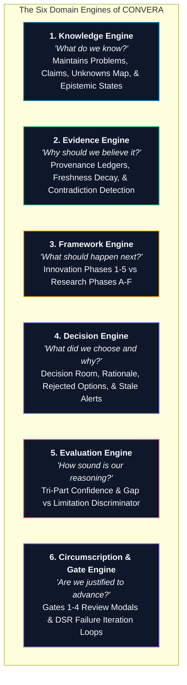
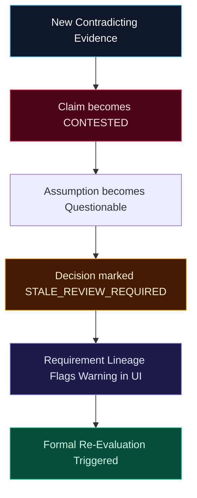

# CONVERA Master Architecture Specification

**Product:** CONVERA  
**Parent Brand:** EMAERX  
**Corporate Tagline:** WHERE WHAT'S NEXT BEGINS.  
**Product Tagline:** WHERE POSSIBILITIES CONVERGE INTO DIRECTION.  
**Standard:** CONVERA Concept Development Standard (CCDS v2.0)  
**Document Type:** Master Product, System, and Architecture Specification  
**Status:** Approved / Implementation Baseline  
**Version:** 2.1  

---

## 1. Executive Summary

CONVERA is an evidence-driven project intelligence and concept development platform.

Its purpose is to help teams transform fragmented ideas, research, assumptions, evidence, and discussions into validated, traceable, and decision-ready direction.

CONVERA is not merely an AI idea generator, chatbot, research notebook, or project management tool. Its central capability is the structured transformation of uncertainty into justified direction.

The foundational architectural principle is:

> ### **Knowledge != Workflow**

Knowledge persists across a project, while workflows are defined by configurable frameworks.

This allows the same CONVERA infrastructure to support:
- **Research:** Scientific & Computing Research Concept Development Program (CRCDP / DSR)
- **Innovation:** Startup Problem-to-Solution Validation (Venture Ratchet)
- **Product:** Product Discovery & UX Specification
- **Capstone:** Academic Capstone & SRS Specification
- **Custom Frameworks:** Declarative user-defined methodologies

The system is governed by the **CONVERA Concept Development Standard (CCDS)** and implemented through six core domain engines:
1. **Knowledge Engine** (Connects: Problems <-> Claims <-> Evidence <-> Unknowns)
2. **Evidence Engine** (Verifies: First-Class Provenance, Freshness Decay, Contradictions)
3. **Framework Engine** (Orchestrates: Innovation Phases 1-5 vs Research Phases A-F)
4. **Decision Engine** (Evaluates: Trade-offs, Decision Room, Stale Re-evaluation Alerts)
5. **Evaluation Engine** (Calibrates: Tri-Part Confidence AI != Evidence != Decision, Gap vs Limitation)
6. **Circumscription & Governance Engine** (Enforces: Gates 1-4 Sign-offs & DSR Failure Loopbacks)

Cross-cutting mechanisms include:
- Ratchet progression control (Gates 1-4)
- Learning Loop / re-evaluation
- Human governance & advisor sign-offs
- First-class provenance & freshness decay
- Multi-hop requirements traceability
- Causal impact propagation

---

## 2. Product Identity

### 2.1 Product
**CONVERA**

*Conceptual meaning:* Where possibilities converge into direction.

### 2.2 Parent Brand
**EMAERX**

*Corporate meaning:* Where What's Next Begins.

### 2.3 Product Definition
CONVERA is an EMAERX framework-driven project intelligence platform that helps teams transform fragmented possibilities, knowledge, evidence, assumptions, and research into validated, traceable, and decision-ready direction.

### 2.4 Core Question
> **"WHAT IS ACTUALLY WORTH PURSUING?"**

### 2.5 North Star
> **"TURN UNCERTAINTY INTO JUSTIFIED DIRECTION."**

### 2.6 Core Philosophy
> *"Don't make the user organize the information for the system. Make the system organize the information for the user."*

---

## 3. Epistemic Maturity Progression

CONVERA distinguishes strictly between software construction and real-world intelligence efficacy using a **5-Tier Epistemic Maturity Ladder**:

```text
                                 5-TIER EPISTEMIC MATURITY LADDER
┌───────────────┐     ┌───────────────┐     ┌───────────────┐     ┌───────────────────────┐     ┌───────────────────────┐
│  IMPLEMENTED  │ ──> │    TESTED     │ ──> │ E2E VERIFIED  │ ──> │ REAL-WORLD VALIDATED  │ ──> │   OUTCOME VALIDATED   │
│ (All Modules) │     │ (81/81 Tests) │     │ (Closed-Loop) │     │  (Awaiting Pilot Run) │     │ (Longitudinal Impact) │
└───────────────┘     └───────────────┘     └───────────────┘     └───────────────────────┘     └───────────────────────┘
```

1. **`IMPLEMENTED`**: All planned routers, engines, persistence layers, and UI components have executable code in the repository.
2. **`TESTED`**: Comprehensive automated test suites (81/81 unit and integration tests passing; 0 TypeScript compilation errors).
3. **`E2E VERIFIED`**: Proven automated end-to-end integration tests confirming multi-hop reactive cascades (Evidence contradiction -> Claim CONTESTED -> Stale Decision warning -> Requirement lineage warning).
4. **`REAL-WORLD VALIDATED`**: Empirical validation gathered through live student capstone cohorts, incubators, and faculty panels.
5. **`OUTCOME VALIDATED`**: Longitudinal proof that CONVERA improves project survival, thesis defense scores, and decision quality.

---

## 4. Problem Definition

Teams increasingly use generative AI, search engines, academic sources, group chats, documents, spreadsheets, interviews, and personal notes to generate and develop project ideas.

These sources operate largely in isolation.

As a result, teams can generate information faster than they can:
- organize it;
- connect it;
- understand it;
- verify it;
- validate it;
- compare alternatives;
- preserve decision context;
- determine what is worth pursuing.

This produces:
- duplicate ideas;
- duplicated research;
- lost context;
- unverified AI-generated claims;
- hidden assumptions;
- uncertainty about existing solutions;
- weak opportunity comparison;
- premature project selection;
- unclear scope;
- requirements rework.

### 4.1 Core Problem
Teams have abundant information but insufficient structure for turning that information into trustworthy decisions.

### 4.2 Core Gap
Teams lack an effective way to transform fragmented ideas, information, evidence, and assumptions into validated, traceable, and decision-ready project opportunities.

---

## 5. Architectural Principles

### 5.1 Knowledge Is Independent of Workflow
CONVERA does not bind project knowledge to a single methodology. A problem, claim, source, evidence item, stakeholder, assumption, interview, decision, or requirement remains persistent and reusable when switching frameworks.

### 5.2 Evidence Before Assertion
Important claims must be distinguishable from: evidence, interpretation, assumption, hypothesis, AI suggestion, and decision.

### 5.3 Problem Before Solution
The system prevents teams from prematurely treating an attractive solution as proof that a meaningful problem exists.

### 5.4 Assumptions Must Be Explicit
Important uncertainty is extracted into testable hypotheses and categorized across the Unknowns Map (*What We Know*, *What We Think*, *What We Don't Know*).

### 5.5 Tri-Part Confidence Calibration
AI fluency is explicitly decoupled from empirical grounding:
```text
AI Model Confidence != Evidence Strength != Decision Confidence
```
Overconfidence warnings are triggered whenever AI certainty is high (>=0.80) but evidence strength is weak (<=0.40).

### 5.6 Human Authority
AI assists with discovery, analysis, synthesis, critique, and drafting. Humans retain final authority over consequential decisions and gate sign-offs.

### 5.7 Traceability
Important decisions and technical requirements must maintain multi-hop lineage:
```text
Problem -> Claim -> Evidence -> Assumption -> Test -> Decision -> Requirement
```

### 5.8 Contradictions Must Be Preserved
Contradictory evidence does not disappear or get synthetically averaged; opposing literature transitions claims into `CONTESTED` status.

### 5.9 Progress Requires Defined Criteria
A project advances through Gates because defined criteria are satisfied, not merely because the team wishes to move forward.

### 5.10 Failure-Driven Circumscription
In Design Science Research, evaluation failure triggers constraint extraction and loops back to artifact redesign rather than abandonment.

---

## 6. The Six Domain Engines



---

## 7. Cross-Cutting Mechanisms

### 7.1 Ratchet Progression Control
Ratchet governs phase transitions via formal Gate Reviews:
- `PASS` - Advance to next stage (rubric score >= threshold and all mandatory criteria satisfied)
- `REVISE` - Improve current stage requirements based on committee feedback
- `HOLD` - Pause for additional field data or prototype trials
- `FAIL` - Fundamental rework required

### 7.2 Closed-Loop Invalidation
When new evidence contradicts an upstream claim, the Impact Engine automatically propagates the invalidation:



### 7.3 DSR Circumscription Loop
Failure in evaluation trials extracts new design constraints and loops back to Phase D (Artifact Design):

```mermaid
graph LR
    EVAL_RUN["Phase E: Benchmark Trial"] --> FAIL["Observed < Target Metric"]
    FAIL --> ANALYZE["Failure Mode Analysis"]
    ANALYZE --> CONST["Extract Design Constraint"]
    CONST --> LOOP["Loopback to Phase D Redesign"]
    LOOP --> PASS["Next Benchmark Run (Target Met)"]
    PASS --> GATE3["Gate 3 Clearance"]

    style FAIL fill:#4c0519,stroke:#f43f5e,color:#ffe4e6
    style CONST fill:#451a03,stroke:#f59e0b,color:#fef3c7
    style PASS fill:#064e3b,stroke:#10b981,color:#d1fae5
```



---

## 8. Relational Data Model (SQLite WAL Schema)

CONVERA uses **20 normalized relational tables** in SQLite WAL mode for high-performance, zero-ops local persistence:

1. `sessions` — Project session state and active framework selection.
2. `projects` — Top-level project entity and share codes.
3. `problems` — Empirical problem briefs, pain quantification, sector categories.
4. `problem_history` — Problem statement audit log.
5. `problem_claims` — Epistemic claims and confidence scores.
6. `claim_evidence_links` — Edges linking claims to sources (`SUPPORTS`, `CONTRADICTS`).
7. `evidence_provenance` — Source provenance metadata and verification status.
8. `claim_contradictions` — Paired supporting vs opposing literature relationships.
9. `problem_assumptions` — Extracted business and technical assumptions.
10. `assumption_validation_tests` — Empirical validation experiments and results.
11. `impact_invalidation_events` — Causal blast-radius invalidation logs.
12. `decision_records` — Immutable decision rationale, chosen concepts, rejected options.
13. `requirements_traceability` — Multi-hop requirement-to-evidence lineage.
14. `project_unknowns` — 3-column triangulation items (Know / Think / Don't Know).
15. `inbox_items` — Unstructured research inbox documents and URLs.
16. `project_snapshots` — Immutable state snapshots and restoration points.
17. `problem_solutions` — Concept solutions across mechanism families.
18. `phase_outputs` — Structured phase artifacts.
19. `gate_reviews` — Formal committee review sign-offs for Gates 1–4.
20. `circumscription_iterations` — Failure-driven DSR evaluation iteration logs.

---

## 9. Formal Pilot Evaluation Framework (Phase 9 Protocol)

To transition from `E2E VERIFIED` to `REAL-WORLD VALIDATED` and `OUTCOME VALIDATED`, the following scientific pilot evaluation protocol is established:

```text
CONVERA PILOT EVALUATION PROTOCOL
|
+-- Target Cohorts
|   +-- Computing Capstone Teams (DSR Track)
|   +-- Startup Incubator Cohorts (Venture Track)
|   +-- Thesis Advisors & Panel Reviewers (Gate Governance)
|
+-- Evaluated Hypotheses
|   +-- H1 (Decision Quality): Does CONVERA increase evidence-grounded project decisions?
|   +-- H2 (Traceability): Can reviewers reconstruct WHY decisions were made?
|   +-- H3 (Research Efficiency): Does federated matrix synthesis reduce research time?
|   +-- H4 (Epistemic Discrimination): Do teams better distinguish Facts vs Claims vs Assumptions?
|   +-- H5 (Uncertainty Awareness): Does the Unknowns Map surface critical risks earlier?
|   +-- H6 (Decision Revision): Do teams reconsider stale decisions when evidence contradicts?
|   +-- H7 (Research Rigor): Does CRCDP produce higher-rated defense proposals?
|
+-- Evaluation Metrics
    +-- Time-to-proposal completion (Hours)
    +-- Citation authenticity rate (%)
    +-- Gate revision cycles before passing (Count)
    +-- System Usability Scale (SUS Score)
    +-- Panel defense evaluation ratings
```

---

## 10. Conclusion

CONVERA provides a unified, evidence-driven project intelligence architecture that bridges the gap between raw generative AI fluency and empirical scientific rigor. By maintaining strict separation between persistent knowledge and configurable workflows, CONVERA ensures that teams turn uncertainty into justified, auditable, and defensible direction.
