# CONVERA Master Architecture Specification

**Product:** CONVERA  
**Parent Brand:** EMAERX  
**Corporate Tagline:** WHERE WHAT'S NEXT BEGINS.  
**Product Tagline:** WHERE POSSIBILITIES CONVERGE INTO DIRECTION.  
**Standard:** CONVERA Concept Development Standard (CCDS)  
**Document Type:** Master Product, System, and Architecture Specification  
**Status:** Master Blueprint / Implementation Baseline  
**Version:** 1.0  

---

## 1. Executive Summary

CONVERA is a framework-driven project intelligence and concept development platform.

Its purpose is to help teams transform fragmented ideas, research, assumptions, evidence, and discussions into validated, traceable, and decision-ready direction.

CONVERA is not merely an AI idea generator, chatbot, research notebook, or project management tool. Its central capability is the structured transformation of uncertainty into justified direction.

The foundational architectural principle is:

> ### **Knowledge != Workflow**

Knowledge persists across a project, while workflows are defined by configurable frameworks.

This allows the same CONVERA infrastructure to support:
- **Research:** Scientific & Computing Research Concept Development
- **Innovation:** Startup & Opportunity Validation
- **Product:** Product Discovery & Development
- **Capstone:** Academic Capstone & Thesis Development
- **Custom Frameworks:** User-defined methodologies

The system is governed by the **CONVERA Concept Development Standard (CCDS)** and implemented through four core engines:
1. **Knowledge Engine** (Connects: Problems <-> Claims <-> Evidence)
2. **Evidence Engine** (Verifies: Ledgers, Provenance, Contradictions)
3. **Framework Engine** (Orchestrates: Stages, Gates, Ratchet, Learning Loop)
4. **Decision Engine** (Evaluates: Trade-offs, Decision Room, Pivots)

Cross-cutting mechanisms include:
- Ratchet progression control
- Learning Loop / re-evaluation
- Human governance
- Versioning
- Provenance
- Traceability
- Impact propagation

---

## 2. Product Identity

### 2.1 Product
**CONVERA**

*Conceptual meaning:* Where possibilities converge into direction.

### 2.2 Parent Brand
**EMAERX**

*Corporate meaning:* Where What's Next Begins.

### 2.3 Product Definition
CONVERA is an EMAERX framework-driven project intelligence platform that helps teams transform fragmented possibilities, knowledge, evidence, assumptions, and research into validated, traceable, and decision-ready direction.

### 2.4 Core Question
> **"WHAT IS ACTUALLY WORTH PURSUING?"**

### 2.5 North Star
> **"TURN UNCERTAINTY INTO JUSTIFIED DIRECTION."**

### 2.6 Core Philosophy
> *"Don't make the user organize the information for the system. Make the system organize the information for the user."*

---

## 3. Problem Definition

Teams increasingly use generative AI, search engines, academic sources, group chats, documents, spreadsheets, interviews, and personal notes to generate and develop project ideas.

These sources operate largely in isolation.

As a result, teams can generate information faster than they can:
- organize it;
- connect it;
- understand it;
- verify it;
- validate it;
- compare alternatives;
- preserve decision context;
- determine what is worth pursuing.

This produces:
- duplicate ideas;
- duplicated research;
- lost context;
- unverified AI-generated claims;
- hidden assumptions;
- uncertainty about existing solutions;
- weak opportunity comparison;
- premature project selection;
- unclear scope;
- requirements rework.

### 3.1 Core Problem
Teams have abundant information but insufficient structure for turning that information into trustworthy decisions.

### 3.2 Core Gap
Teams lack an effective way to transform fragmented ideas, information, evidence, and assumptions into validated, traceable, and decision-ready project opportunities.

---

## 4. Core Transformation

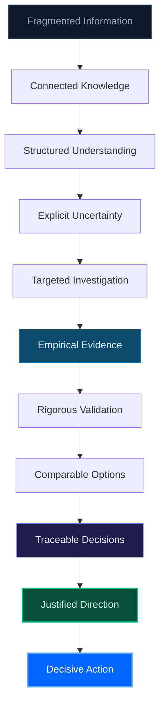

---

## 5. Architectural Principles

### 5.1 Knowledge Is Independent of Workflow
CONVERA must not bind project knowledge to a single methodology. A problem, claim, source, evidence item, stakeholder, assumption, interview, decision, or requirement should remain reusable when the framework changes.

### 5.2 Evidence Before Assertion
Important claims should be distinguishable from: evidence, interpretation, assumption, hypothesis, AI suggestion, and decision.

### 5.3 Problem Before Solution
The system should prevent teams from prematurely treating an attractive solution as proof that a meaningful problem exists.

### 5.4 Assumptions Must Be Explicit
Important uncertainty should become a named, testable assumption.

### 5.5 Human Authority
AI may assist with discovery, analysis, synthesis, critique, and drafting. Humans retain authority over consequential decisions.

### 5.6 Traceability
Important decisions and outputs must be traceable to the knowledge and evidence supporting them.

### 5.7 Contradictions Must Be Preserved
Contradictory evidence should not silently disappear.

### 5.8 Progress Requires Criteria
A project advances because defined conditions are satisfied, not merely because the team wants to move forward.

### 5.9 Learning Can Change Direction
New evidence may invalidate earlier assumptions and require re-evaluation.

### 5.10 Artifacts Are Views of Knowledge
Generated documents should be treated as structured views/syntheses of underlying project knowledge rather than isolated sources of truth.

---

## 6. CONVERA Concept Development Standard (CCDS)

### 6.1 Purpose
The **CONVERA Concept Development Standard (CCDS)** is the governing methodological standard for CONVERA. CCDS defines the principles that all frameworks must follow while allowing each framework to define its own domain-specific workflow.

### 6.2 Standard Principles
1. **Evidence before assertion:** No claim stands without empirical grounding.
2. **Problem before solution:** Solutioning is locked until friction is proven.
3. **Assumptions must be explicit:** Hidden risk is extracted into testable hypotheses.
4. **Claims must have traceable support:** Provenance linked to primary sources.
5. **Evidence must preserve provenance:** DOIs, timestamps, and interview records.
6. **Contradictory evidence must not be hidden:** Conflicting signals are highlighted.
7. **Alternatives should be considered:** Workarounds and competitors benchmarked.
8. **Decisions require explicit rationale:** Immutable selection and rejection logs.
9. **Progress requires defined criteria:** Objective thresholds per stage.
10. **Human judgment remains authoritative:** AI advises; founders decide.
11. **AI assists rather than replaces decision authority:** Guardrails against autonomy.
12. **New evidence can trigger re-evaluation:** Learning loops reverse stale choices.
13. **Knowledge persists independently of workflow:** Relational graph continuity.
14. **Feasibility and responsible-use constraints matter:** Real-world delivery limits.
15. **Important decisions and revisions must be traceable:** Bidirectional audit trail.

---

## 7. Product and Framework Hierarchy

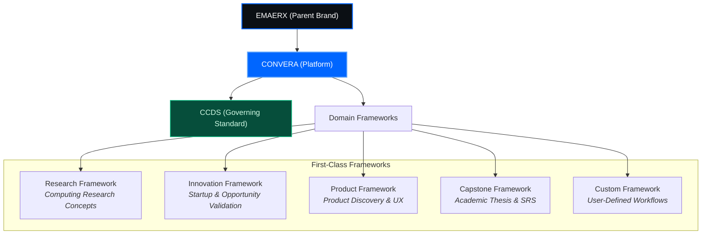

---

## 8. Four Core Engines

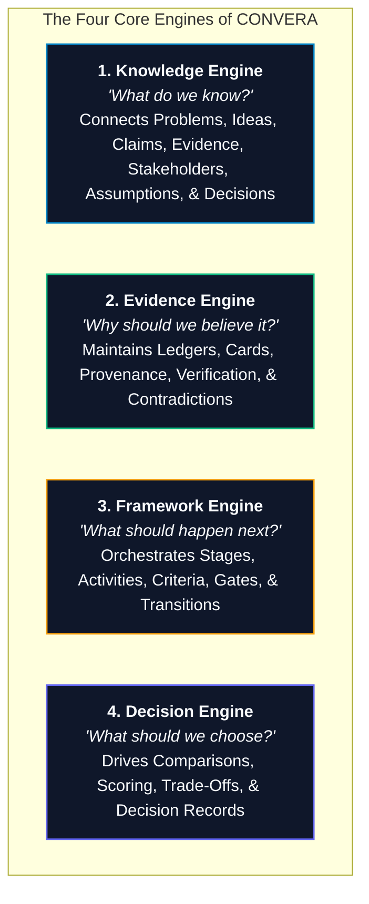

---

## 9. Cross-Cutting Mechanisms

### 9.1 Ratchet Progression Control
Ratchet is an internal CONVERA governance mechanism controlling progression:
- `PASS` → Advance to next stage
- `REVISE` → Improve current stage requirements
- `HOLD` → Pause for additional field evidence
- `FAIL` → Return, reject, or archive

### 9.2 Learning Loop
The Learning Loop manages iteration and re-evaluation when new field evidence invalidates an upstream premise:

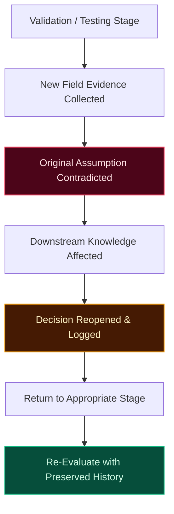

### 9.3 Impact Propagation
When a foundational claim or assumption changes, CONVERA identifies downstream entities affected by that change:

```mermaid
graph LR
    EV["Evidence Changes"] --> CL["Claim Updated"]
    CL --> AS["Assumption Invalidated"]
    AS --> VR["Validation Shifted"]
    VR --> DC["Decision Reopened"]
    DC --> AR["Artifact Marked Stale"]
    AR --> GT["Gate Requires Review"]
    
    style AS fill:#4c0519,stroke:#f43f5e,color:#ffe4e6
    style AR fill:#451a03,stroke:#f59e0b,color:#fef3c7
    style GT fill:#1e1b4b,stroke:#818cf8,color:#e0e7ff
```

---

## 10. Persistent Relational Knowledge Graph

CONVERA uses a relational database with explicit foreign key relationships rather than requiring a dedicated graph database:
- Low operational complexity
- Full compatibility with SQLite WAL & PostgreSQL
- Strict relational integrity & cascading foreign keys
- Sub-millisecond queries

### 10.1 Conceptual Graph Structure

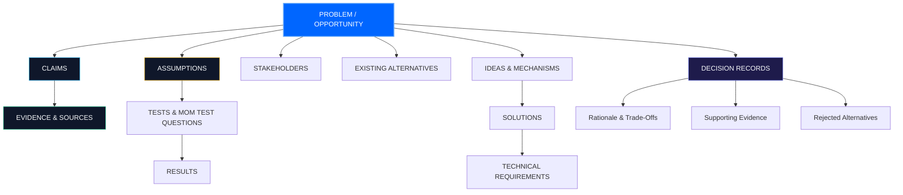

---

## 11. Core Domain Model

1. **Workspace:** Persistent project environment containing context, team, framework version, knowledge, evidence, decisions, artifacts, and history.
2. **Framework:** Defines a reusable methodology (ID, version, purpose, stages, activities, criteria, gates, transition rules, required artifacts, AI roles).
3. **Concept:** The central project/opportunity/research concept being developed.
4. **Claim:** A proposition requiring evidence.
5. **Evidence:** Information that supports, contradicts, or contextualizes a claim.
6. **Source:** The origin of evidence (paper, interview, government record, observation, dataset).
7. **Assumption:** An uncertain proposition that can be tested.
8. **Test & Result:** A defined method for evaluating an assumption and its outcome.
9. **Decision:** A selected direction resulting from evaluation.
10. **Alternative:** An option considered but not necessarily selected.
11. **Requirement:** System/product/research requirement derived from validated knowledge.
12. **Artifact:** A generated or authored project deliverable derived from underlying knowledge.

---

## 12. Recommended Database Schema Structure

```sql
-- Workspaces & Frameworks
workspaces
frameworks
framework_versions
stages
activities
gates
criteria
transition_rules

-- Core Knowledge Entities
concepts
problems
ideas
solutions
stakeholders

-- Evidence & Epistemics
claims
evidence
sources
assumptions
tests
test_results

-- Decisioning & Specifications
alternatives
requirements
reviews
decisions
decision_records

-- Artifacts & Audit Trail
artifacts
artifact_versions
ai_runs
audit_events
users
teams
permissions
```

---

## 13. Evidence Ledger

Every important project claim is represented explicitly:


- **Evidence Types:** Discovery signal, Contextual evidence, Validation evidence.
- **Evidence Quality Metrics:** Credibility, relevance, scope, date, definition, limitations, methodology, context, consistency with other evidence.

---

## 14. Assumption Radar

Turns critical uncertainty into testable propositions:

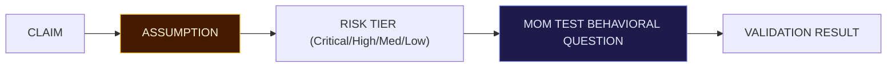

---

## 15. AI / Research Inbox

Reduces manual entry friction. Users dump raw material (text, AI chats, URLs, DOIs, PDFs, interview transcripts, notes, screenshots) and CONVERA automatically extracts, classifies, and connects them into the Knowledge Graph subject to human review.

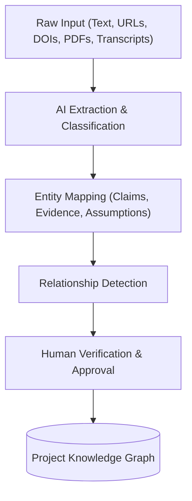

---

## 16. Duplicate and Similarity Engine

Identifies duplicate ideas, semantically similar problems, related concepts, repeated evidence, repeated sources, and contradictory claims beyond literal wording.

---

## 17. Idea Genealogy

Preserves the complete lineage of concept evolution:

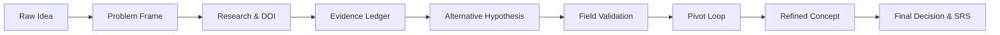

---

## 18. Decision Room

The primary interface for consequential project choices. Preserves options considered, selected option, rejected options, criteria, scores, trade-offs, supporting evidence, contradictory evidence, assumptions, rationale, participants, date, framework stage, and version.

---

## 19. Artifact System

Artifacts are derived project outputs indicating their freshness:
- `CURRENT`
- `STALE`
- `REQUIRES_REVIEW`
- `INVALIDATED`
- `SUPERSEDED`

---

## 20. Traceability Architecture

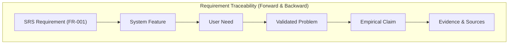

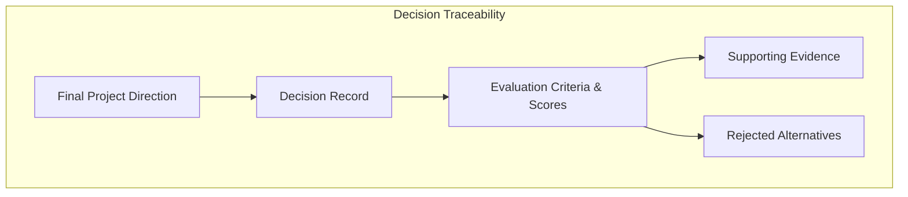

---

## 21. Versioning and Audit

Preserves all previous claims, evidence interpretations, assumptions, decisions, framework versions, artifacts, and gate decisions.

```text
WHO · WHAT · WHEN · WHY · BASED ON WHAT
```

---

## 22. Human-in-the-Loop Governance

- **AI May:** Discover, summarize, extract, compare, analyze, critique, generate hypotheses, generate questions, draft artifacts, suggest relationships.
- **Humans Decide:** Evidence acceptability, problem validity, research significance, assumption acceptance, framework advancement, pivot, rejection, ethical acceptability, practical feasibility.
- **Statuses:** `AI_DRAFT`, `AI_SUGGESTION`, `AI_ANALYSIS`, `HUMAN_REVIEWED`, `HUMAN_APPROVED`.

---

## 23. Framework Architecture & First-Class Guardrail

Frameworks are configurable and versioned schemas.

> [!IMPORTANT]
> **First-Class Framework Guardrail:** Do not build a fully generic, Turing-complete workflow DSL at the beginning. Stabilize `Innovation`, `Research`, `Capstone`, and `Product` as structured schemas first before introducing dynamic custom-framework builders.

---

## 24. Research Framework
Stages:
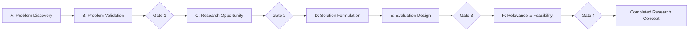

---

## 25. Innovation Framework
Stages:
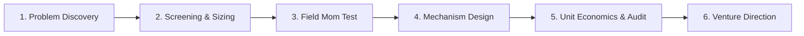

---

## 26. Product Framework
Stages:
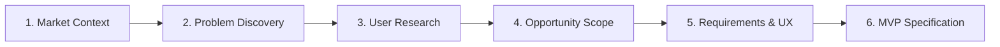

---

## 27. Capstone Framework
Stages:
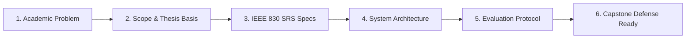

---

## 28. Custom Framework
User-defined stages, activities, evidence requirements, criteria, gates, and artifacts (enabled in Phase F).

---

## 29. Multi-Agent AI Architecture
Specialized, framework-aware agents (Problem Researcher, Literature Researcher, Source Verifier, Customer Researcher, Competitor Analyst, Requirements Analyst, Technical Architect).

---

## 30. Project Health
Calculated from evidence completeness, assumption risk, validation status, research strength, contradiction count, decision quality, and stale artifacts.

---

## 31. Impact Propagation and Stale Knowledge
Automated dependency chain identification when evidence refutes an assumption.

---

## 32. Core User Experience
Persistent workspace exposing: Overview, Framework, Knowledge, Evidence, Assumptions, Research, Ideas, Alternatives, Decisions, Requirements, Artifacts, and History.

---

## 33. Existing System Mapping
- Problem Discovery → Discovery capability
- 10-Column Screening → Assessment engine
- Mom Test → Validation methodology
- Evidence Ledger → Evidence Engine
- Devil's Advocate → Assumption Radar
- Decision Log → Governance
- Ratchet → Progression engine
- Learning Loop → Re-evaluation engine
- SRS Generator → Artifact / Deliverable Engine

---

## 34. Technical Architecture
- **Frontend:** Next.js 16 (App Router), React 19, Tailwind CSS.
- **Backend:** Python 3.12, FastAPI, Pydantic v2.
- **Persistence:** SQLite WAL (Zero-Ops) / PostgreSQL.

---

## 35. API / Domain Service Boundaries
`workspace_service`, `framework_service`, `knowledge_service`, `evidence_service`, `assumption_service`, `validation_service`, `decision_service`, `research_service`, `artifact_service`, `audit_service`.

---

## 36. Framework Execution Model
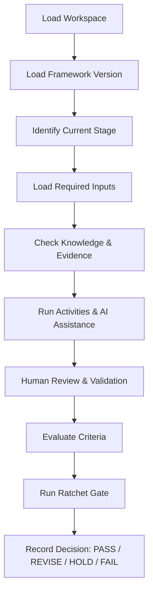

---

## 37. Gate Governance
Explicit records defining Gate ID, framework, stage, criteria, required evidence, evaluator, decision, rationale, timestamp, and version.

---

## 38. Re-Evaluation Rules
Identify affected claims, assumptions, validation results, decisions, artifacts, and gates. Mark stale, notify team, recommend return point, and preserve history.

---

## 39. Security, Integrity, and Responsible Use
Role-based access, project passcodes, audit logging, source provenance, version control, and privacy-aware data handling.

---

## 40. Export and Portability
Markdown, PDF, JSON, and CSV exports with provenance and version context.

---

## 41. Implementation Roadmap

- **Phase A — Core Engines Formalization & CCDS:** *(Completed / Current Baseline)* Rebrand to CONVERA, formalize CCDS, consolidate Knowledge, Evidence, Decision, and SRS capabilities.
- **Phase B — Framework Engine & Multi-Framework Support:** *(Next)* Add `framework_id` to workspace/session, define Innovation, Research, Capstone, and Product schemas.
- **Phase C — Impact Propagation & AI Research Inbox:** Connect assumption invalidation to downstream artifacts, support multi-modal raw ingestion (URLs, PDFs, transcripts).
- **Phase D — Project Health & Export Bundler:** Unified health score and master thesis/venture PDF compiler.
- **Phase E — Advanced Intelligence:** Semantic duplicate and contradiction detection.
- **Phase F — Custom Frameworks:** User-defined framework builder.

---

## 42. Three Mandatory Engineering Guardrails

1. **Guardrail 1 — Avoid the Generic Workflow DSL Trap:** Build Innovation, Research, Capstone, and Product as structured schemas first.
2. **Guardrail 2 — Minimize Manual Ingestion:** Prioritize Raw Input → AI Extraction → Classification → Linking → Human Review.
3. **Guardrail 3 — Separate AI Confidence from Evidence Strength:** Never display AI confidence as empirical validation.

---

## 43. MVP Scope
Focus on existing Innovation Workflow, Knowledge Engine, Evidence Ledger, Assumption Radar, Decision Room, Ratchet, Learning Loop, and Basic Framework Engine.

---

## 44. Definition of Done for Architectural Transition
Complete when CONVERA is the official product identity, CCDS is the governing standard, Knowledge is independent of workflow, Frameworks are versioned, Innovation and Research modes are operational, and history is preserved.

---

## 45. Final Architecture Diagram

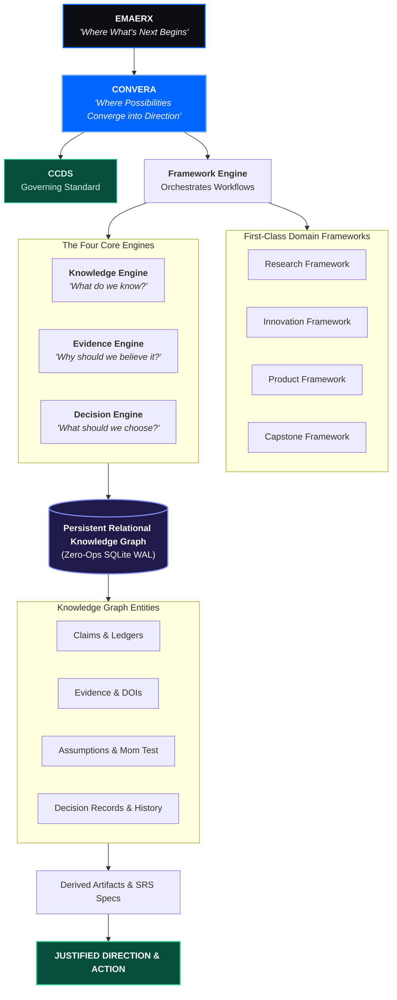

---

## 46. The CONVERA Operating Loop


---

## 47. Final Conceptual Model
- **Knowledge Engine:** *"What do we know?"*
- **Evidence Engine:** *"Why should we believe it?"*
- **Framework Engine:** *"What should happen next?"*
- **Decision Engine:** *"What should we choose?"*
- **Learning Loop:** *"What changed, and do we need to reconsider?"*

---

## 48. Final Product Definition

**CONVERA is an EMAERX framework-driven project intelligence platform that helps teams transform fragmented ideas, research, assumptions, evidence, and discussions into validated, traceable, and decision-ready direction.**

- **Tagline:** *WHERE POSSIBILITIES CONVERGE INTO DIRECTION.*
- **North Star:** *TURN UNCERTAINTY INTO JUSTIFIED DIRECTION.*
- **Core Principle:** *DON'T MAKE THE USER ORGANIZE THE INFORMATION FOR THE SYSTEM. MAKE THE SYSTEM ORGANIZE THE INFORMATION FOR THE USER.*

---

## 49. Final Strategic Position

CONVERA is a framework-driven project intelligence system that connects knowledge, evidence, uncertainty, decisions, and action.

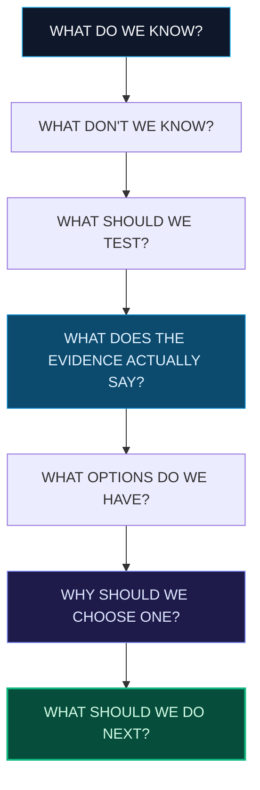

**CONVERA: WHERE POSSIBILITIES CONVERGE INTO DIRECTION.**
