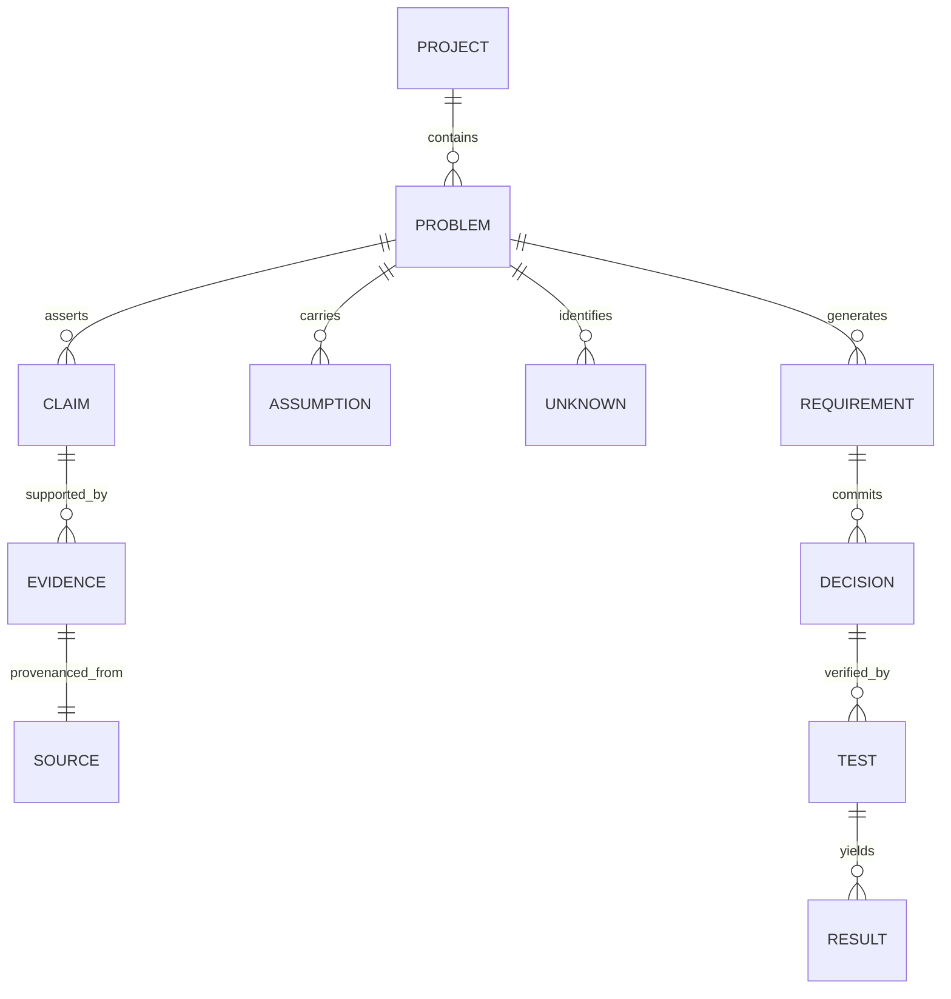

# CONVERA — Methodology-Governed Project Intelligence Architecture

**Governing Standard:** CONVERA Concept Development Standard (CCDS v2.0)  
**Core Architectural Axiom:** `Knowledge ≠ Workflow`  
**Parent System:** CONVERA — Evidence-Driven Project Intelligence and Decision System by EMAERX  
**Classification:** Core System Architecture & Epistemic Specification  

---

## 1. Executive Summary & Paradigm Shift

Historically, early project management and innovation tools suffered from **workflow hardcoding**—baking startup-specific stages (`Problem → Validation → Solution → MVP`) directly into the database schemas, UI layouts, and AI prompts. This rendered them useless for academic research, engineering design, product management, or scientific discovery without rewriting the underlying application.

CONVERA solves this fundamentally by decoupling **Domain Intelligence Infrastructure** from **Methodology Governance**:

```text
                               CONVERA PLATFORM
                                      │
              ┌───────────────────────┼───────────────────────┐
              │                       │                       │
       Knowledge Engine        Evidence Engine         Decision Engine
     ("What do we know?")   ("Why do we believe?")  ("What do we choose?")
              │                       │                       │
              └───────────────────────┼───────────────────────┘
                                      │
                              Framework Engine
                       ("What should happen next?")
                                      │
        ┌─────────────────────────────┼─────────────────────────────┐
        │                             │                             │
   Innovation                     Research                       Product
   Framework                     Framework                      Framework
(Venture Ratchet)             (CRCDP / DSR)                (PRD & Engineering)
```

> **The Axiomatic Rule:**  
> **CONVERA provides the methodology-agnostic intelligence infrastructure; Frameworks provide the methodology-specific governance.**

---

## 2. The Four Decoupled Tiers of CONVERA

```text
┌──────────────────────────────────────────────────────────────────────────────────────────────────┐
│                                   THE FOUR DECOUPLED TIERS                                       │
├─────────────────────┬────────────────────────────────────────────────────────────────────────────┤
│ A. Knowledge Engine │ Maintains persistent knowledge entities: Problems, Claims, Evidence,       │
│                     │ Assumptions, Unknowns, Requirements, Decisions, Tests, and Artifacts.     │
├─────────────────────┼────────────────────────────────────────────────────────────────────────────┤
│ B. Evidence Engine  │ Evaluates epistemic strength, source provenance (Tier A/B/C, DOIs),        │
│                     │ triangulation, contradiction detection, and confidence calibration.        │
├─────────────────────┼────────────────────────────────────────────────────────────────────────────┤
│ C. Decision Engine  │ Structures trade-off matrices, records immutable decision records, and     │
│                     │ triggers closed-loop invalidation when underlying evidence changes.        │
├─────────────────────┼────────────────────────────────────────────────────────────────────────────┤
│ D. Framework Engine │ Acts as the methodology interpreter/governor: defines stages, quality      │
│                     │ gates, required artifacts, allowed transitions, and AI steering context.   │
└─────────────────────┴────────────────────────────────────────────────────────────────────────────┘
```

---

## 3. Knowledge Entities are Methodology-Independent

In CONVERA, the database schemas (20 SQLite WAL tables) never store framework-locked fields. All conceptual entities are first-class citizens shared across any active methodology:



When a user switches their active framework from `INNOVATION` to `RESEARCH`, **not a single row of knowledge is altered or lost**. The Framework Engine simply reinterprets which entities are required to satisfy the upcoming quality gate.

---

## 4. Methodology Governance Specification (Declarative DSL)

A Framework is defined as a declarative, versioned methodology schema:

```yaml
framework:
  id: "RESEARCH"
  name: "Computing Research Concept Development Framework"
  version: "2.0.0"
  governing_standard: "CCDS v1.0 / DSR Hevner Matrix"
  category: "RESEARCH"
  tagline: "Discover, validate, formulate, evaluate, and select rigorous computing research concepts."

  stages:
    - id: "stage_a_discovery"
      number: 1
      code: "Stage A"
      label: "Problem Discovery & Empirical Intake"
      required_artifacts:
        - "Research Problem Intake Card"
      allowed_actions:
        - "ingest_field_signals"
        - "cluster_domain_breakdowns"

    - id: "stage_b_validation"
      number: 2
      code: "Stage B"
      label: "Problem Validation & Dual Grounding"
      required_artifacts:
        - "Validated Problem Dossier"
        - "Literature Evidence Card"
      gate:
        id: "research_gate_1"
        name: "Gate 1: Problem Significance"
        required_evidence_types:
          - "PEER_REVIEWED_DOI"
          - "OFFICIAL_STATISTICS"
        passing_criteria:
          - id: "crit_g1_1"
            name: "Empirical Reality Supported"
            weight: 0.5
          - id: "crit_g1_2"
            name: "Measurable Impact Sized"
            weight: 0.5
        outcomes:
          - "PASS"
          - "REVISE"
          - "HOLD"
          - "REJECT"

    - id: "stage_c_opportunity"
      number: 3
      code: "Stage C"
      label: "Research Opportunity & Prior Art Matrix"
      required_artifacts:
        - "Literature Matrix Table"
        - "Primary & Sub Research Questions"
      gate:
        id: "research_gate_2"
        name: "Gate 2: Research Gap Quality"
        passing_criteria:
          - id: "crit_g2_1"
            name: "Genuine Gap vs Routine Engineering"
            weight: 0.6
          - id: "crit_g2_2"
            name: "Answerable Research Question"
            weight: 0.4
```

---

## 5. Contextual AI Steering (AI as Capability, Not Identity)

CONVERA avoids the "generic chat bot" antipattern. Instead of asking the user *"What do you want to do today?"*, CONVERA synthesizes the **Methodology Execution State** and injects it directly into the AI prompt:

```text
┌────────────────────────────────────────────────────────────────────────────────────────┐
│                                 AI STEERING PIPELINE                                   │
├────────────────────────────────────────────────────────────────────────────────────────┤
│ 1. Methodology Context │ Active Framework: Research (Stage C: Opportunity)             │
│ 2. Epistemic Inventory │ 12 Claims · 27 Indexed Sources · 4 Unresolved Unknowns        │
│ 3. Gate Constraints    │ Gate 2: Gap Quality · Mandatory: Baseline Failure Proof       │
│ 4. System Telemetry    │ 1 Contradiction Detected · 0 Premature Technology Selections  │
└────────────────────────┴────────────────────────────────────────────────────────────────┘
                                            ↓
                               [ CIIA AI Gateway Cascade ]
                                            ↓
┌────────────────────────────────────────────────────────────────────────────────────────┐
│                        METHODOLOGY-AWARE AI RECOMMENDATION                             │
│ "Based on Stage C requirements and your 4 unresolved unknowns, investigate whether     │
│  Limitation #3 in Santos et al. (2024) represents a genuine algorithmic gap or a       │
│  routine hardware constraint before proceeding to Gate 2."                             │
└────────────────────────────────────────────────────────────────────────────────────────┘
```

---

## 6. UI/UX Interaction Paradigm: The Unified Methodology HUD

The user must **never be burdened with architectural complexity**. They should not see raw database tables or engine routers. Instead, every workspace screen is structured around the **4-Part Methodology HUD**:

```text
┌───────────────────────────────────────────────────────────────────────────────────────────┐
│  CONVERA · Computing Research Concept Development · Stage 3 of 6: Research Opportunity    │
├───────────────────────────────────────────────────────────────────────────────────────────┤
│                                                                                           │
│  📊 WHAT YOU KNOW                                                                         │
│  27 Indexed Academic Papers · 12 Verified Problem Claims · 0 Contradictions               │
│                                                                                           │
│  ❓ WHAT REMAINS UNCERTAIN                                                                │
│  4 Unresolved Research Unknowns (Algorithm Convergence, Sample Size Bias)                │
│                                                                                           │
│  ⚠️ WHAT NEEDS ATTENTION                                                                  │
│  [Potential Gap] Santos et al. (2024) limitation has not been verified against prior art.│
│                                                                                           │
│  🛡️ GATE 2: RESEARCH GAP QUALITY                                                          │
│  ● Status: NOT READY (Missing baseline benchmark comparison)                              │
│                                                                                           │
│  👉 RECOMMENDED NEXT ACTION                                                               │
│  [ Verify Literature Matrix Gap ]  [ Run Prior Art Comparator ]                           │
│                                                                                           │
└───────────────────────────────────────────────────────────────────────────────────────────┘
```

---

## 7. Comparative Framework Profiles

| Dimension | Innovation Framework (Venture Ratchet) | Research Framework (CRCDP / DSR) | Product Framework (PRD / Engineering) |
|---|---|---|---|
| **Primary Goal** | De-risk startup venture opportunities & unit economics. | Discover & justify rigorous computing research proposals. | Define software specifications, PRDs & user journeys. |
| **Problem Unit** | Customer Friction & Workaround Inefficiency. | Domain Breakdown & Algorithmic Inefficiency. | User Pain Point & Functional Requirement. |
| **Evidence Type** | Mom Test Interviews, LOIs, Field Expense Logs. | Peer-Reviewed DOIs, Benchmarks, Citations. | Telemetry, Usability Tests, Feature Requests. |
| **Core Gate 1** | Opportunity Worthiness ($Score \ge 75$). | Problem Significance (Dual Grounding). | Strategic Fit & Market Feasibility. |
| **Core Gate 2** | Empirical Pain Validation (Past Behavior). | Research Gap Quality (Genuine Missing Knowledge). | Technical Architecture & Feasibility. |
| **Output Deliverable** | Lean Canvas, SVB Blueprint, Pitch Deck. | Literature Matrix, DSR Proposal, LaTeX Export. | PRD, System Architecture Diagram, User Stories. |

---

## 8. Strategic Conclusion

By decoupling **Knowledge** from **Workflow**, CONVERA achieves infinite scalability without code sprawl:
1. **Zero Greenfield Duplication:** Adding an *Engineering Design* or *Policy Impact* framework requires only a declarative JSON/YAML specification.
2. **Persistent Value:** A student team can validate a problem in the *Innovation Framework*, switch to the *Research Framework* to write their thesis proposal, and switch to the *Product Framework* to build their software, with **100% data continuity**.
3. **Institutional Rigor:** Quality gates prevent users from building solutions before confirming problems, ensuring defensible outcomes every time.
