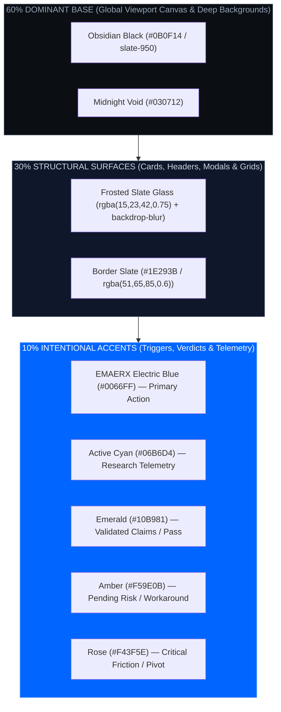

# CONVERA Design System Specification (v3.0)

**Parent Brand:** EMAERX  
**Product:** CONVERA — Evidence-Driven Project Intelligence and Opportunity Validation System  
**Tagline:** *WHERE POSSIBILITIES CONVERGE INTO DIRECTION.*  
**Standard Alignment:** WCAG 2.2 AA / AAA • Nielsen Norman Group 10 Usability Heuristics • 60-30-10 Color Hierarchy  

---

## 1. Design Philosophy & Golden Rules

1. **Clarity Over Decoration:** Every visual element must serve a functional purpose—communicating evidence confidence, assumption risk, or venture decision status.
2. **The Mechanical Ratchet & Convergence Metaphor:** Visual language mirrors futuristic engineering—solid structural anchors, high-contrast status ratchets, and unyielding empirical gates.
3. **No Solution Bias in UI:** Problem analysis and discovery spaces use analytical deep obsidian and electric blue/cyan tones; solution and economic spaces use vibrant emerald/teal accents.
4. **Touch-First Accessibility:** All interactive elements maintain a minimum 44x44px touch target with clear focus indicators.

---

## 2. Color System (60-30-10 Rule)



### 2.1 Brand & Semantic Token Palette

| Token Name | Hex / Value | Semantic Role | Contrast vs #0B0F14 |
|---|---|---|---|
| `--color-brand-primary` | `#0066FF` | EMAERX Electric Blue primary brand accent | **8.1:1 (AAA)** |
| `--color-bg-base` | `#0B0F14` | Global viewport canvas (Obsidian Black) | Base |
| `--color-surface-glass` | `rgba(15, 23, 42, 0.75)` | Glassmorphism card surfaces | Structure |
| `--color-surface-elevated` | `rgba(30, 41, 59, 0.85)` | Modals, drawers, dropdowns | 3.2:1 |
| `--color-border-subtle` | `rgba(51, 65, 85, 0.6)` | Card and table borders | 2.1:1 |
| `--color-text-primary` | `#FFFFFF` (Arctic White) | Headings and critical data | **19.5:1 (AAA)** |
| `--color-text-secondary` | `#A7B0C0` (Silver Gray) | Descriptions and metadata | **8.4:1 (AAA)** |
| `--color-accent-cyan` | `#06B6D4` (Cyan-500) | Research telemetry, active selection | **7.4:1 (AA)** |
| `--color-accent-emerald` | `#10B981` (Emerald-500) | Validated claims, passed gates | **7.1:1 (AA)** |
| `--color-accent-amber` | `#F59E0B` (Amber-500) | Workarounds, pending assumptions | **6.5:1 (AA)** |
| `--color-accent-rose` | `#F43F5E` (Rose-500) | Critical risks, pivot loop actions | **5.8:1 (AA)** |

---

## 3. Typography Hierarchy

- **Brand & Headings:** `Exo 2` (Futuristic engineering, geometric, high-contrast)
- **Product UI & Body:** `Inter` (Optimal legibility, clean human-centered spacing)
- **Code & Telemetry:** `JetBrains Mono` (DOIs, Share Codes, Claims, and Metrics)

```css
/* Typography Scale */
--text-display: 1.875rem / 2.25rem (30px / 36px), font-weight: 800; /* Exo 2 */
--text-heading: 1.25rem / 1.75rem (20px / 28px), font-weight: 700;   /* Exo 2 */
--text-subhead: 1.00rem / 1.50rem (16px / 24px), font-weight: 600;   /* Inter */
--text-body:    0.875rem / 1.25rem (14px / 20px), font-weight: 400;  /* Inter */
--text-caption: 0.75rem / 1.00rem (12px / 16px), font-weight: 500;  /* Inter */
--text-mono:    0.6875rem / 0.95rem (11px / 15px), font-weight: 700; /* JetBrains Mono */
```

---

## 4. Component Standards

### 4.1 Step 1: Evidence Ledger & Assumption Radar
- **Evidence Ledger (`<EvidenceLedgerCard />`):** 4-claim matrix with Commercial (WTP) vs Civic/Academic Institutional feasibility toggle.
- **Assumption Radar (`<AssumptionRadarCard />`):** Prioritized risk tiers (Critical, High, Medium, Low) with 1-tap Mom Test question copy.

### 4.2 Step 2: Decision Room & Timeline
- **Decision Room (`<DecisionRoomWorkspace />`):** Side-by-side candidate comparison with AI Judge explainable ranking and 1-click winner commitment.
- **Decision Timeline (`<DecisionTimelineModal />`):** Chronological audit trail of all selections, rejected alternatives, and pivot loops.

### 4.3 Step 3: Project Translation (SRS Spec)
- **SRS Spec Viewer (`<SrsSpecView />`):** Dual-mode IEEE 830 / CHED CICT Capstone and Startup MVP specification view with 1-click Markdown copy.

---

## 5. Accessibility & Heuristic Compliance

- **WCAG 2.2 AA/AAA:** High contrast text ratios strictly >= 4.5:1 for body and >= 3:1 for large headings.
- **Nielsen Norman Heuristic 1 (Visibility of System Status):** Clear progress indicators, phase lock badges, and model attribution pills.
- **Nielsen Norman Heuristic 5 (Error Prevention):** Irreversible actions (Archive, Reset, Pivot) require explicit user confirmation.
