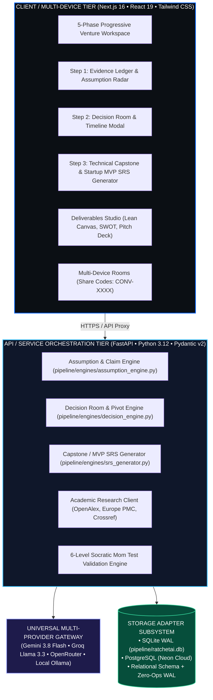

# Software Requirements & System Design Specification (SRSDS)

**Project:** CONVERA — Evidence-Driven Project Intelligence and Opportunity Validation System  
**Parent Brand:** EMAERX (Technology and Innovation Team)  
**Governing Baseline:** [CONVERA Master Architecture Specification (v1.0)](./CONVERA_MASTER_ARCHITECTURE.md)  
**Standard:** CONVERA Concept Development Standard (CCDS) / IEEE 830 / ISO/IEC/IEEE 29148 / IEEE 1016-2009 / CHED CICT Standards  
**Version:** 3.0.0 (Unified Evidence Ledger, Decision Intelligence & Project Translation)  
**Status:** Approved / Production Verified  
**Last Updated:** September 3, 2026  

---

## 1. Executive Summary & Brand Identity

### 1.1 Brand Identity & Purpose
**CONVERA** is an **Evidence-Driven Project Intelligence and Opportunity Validation System** developed by **EMAERX**.

- **Brand Tagline:** *WHERE POSSIBILITIES CONVERGE INTO DIRECTION.*
- **Brand Philosophy:** Meaningful innovation begins by exploring what is not yet understood. CONVERA brings fragmented ideas, research, AI outputs, assumptions, and field evidence together until a team can identify a direction that is empirically justified to pursue.
- **Founders:** Mark Alvin, Mae Daniella Faith, John Emmanuel (EMAERX).

### 1.2 Core Problem Solved
Student technopreneurship and computing capstone teams suffer from **information fragmentation** and **premature solutioning**. Ideas generated across AI chats, group chats, documents, spreadsheets, and personal notes are lost or debated without evidence. CONVERA bridges the **problem-to-decision gap** by organizing, validating, and translating raw ideas into decision-ready project opportunities.

### 1.3 The Mechanical Ratchet & Progressive Framework
CONVERA enforces two complementary mechanisms:
1. **The Mechanical Ratchet Invariant:**
   A downstream phase cannot be unlocked until the current phase passes its empirical gate:
   ```text
   Phase(k+1) Unlocked <=> Gate(Phase(k)) == PASSED
   ```
   Downstream prototyping (Phases 4 & 5) is strictly locked until upstream problem validation (Phases 1, 2, & 3) passes empirical rigor checks.
2. **The 3-Step Unified Evolution:**
   - **Step 1 — Evidence Foundation:** 4-Claim Evidence Ledger, Prioritized Assumption Radar, and DOI research paper grounding.
   - **Step 2 — Decision Intelligence:** Decision Room Workspace, Explainable AI ranking, Immutable Decision Audit Log (`decision_records`), and Phase 3 Pivot / Re-evaluate learning loops.
   - **Step 3 — Project Translation:** Software Requirements Specification (SRS) Generator translating validated opportunities into IEEE 830 / CHED CICT engineering blueprints.

---

## 2. System Architecture & Component Model

CONVERA employs a decoupled **PC-Powered High-Performance Hybrid Architecture**:



---

## 3. Relational Storage Schema Specification

CONVERA's Knowledge Graph is persisted in SQLite with Write-Ahead Logging (WAL) enabled:

### 3.1 Database Tables

```sql
-- 1. Projects & Multi-Device Collaboration
CREATE TABLE IF NOT EXISTS projects (
    id TEXT PRIMARY KEY,
    share_code TEXT UNIQUE NOT NULL,
    name TEXT NOT NULL,
    passcode TEXT,
    created_at TIMESTAMP DEFAULT CURRENT_TIMESTAMP
);

-- 2. Sessions & Phase Progress State
CREATE TABLE IF NOT EXISTS sessions (
    session_id TEXT PRIMARY KEY,
    project_id TEXT,
    state_data TEXT NOT NULL,
    project_name TEXT DEFAULT 'Venture Project',
    created_at TIMESTAMP DEFAULT CURRENT_TIMESTAMP,
    updated_at TIMESTAMP DEFAULT CURRENT_TIMESTAMP,
    FOREIGN KEY(project_id) REFERENCES projects(id) ON DELETE CASCADE
);

-- 3. Curated Problem Bank & Grounding
CREATE TABLE IF NOT EXISTS problems (
    id TEXT PRIMARY KEY,
    problem_statement TEXT NOT NULL,
    sufferer_occupation TEXT NOT NULL,
    sufferer_location TEXT NOT NULL,
    quantified_impact TEXT NOT NULL,
    workaround TEXT NOT NULL,
    status TEXT NOT NULL DEFAULT 'active',
    score REAL DEFAULT 80.0,
    sources TEXT DEFAULT '[]',
    notes TEXT,
    created_at TIMESTAMP DEFAULT CURRENT_TIMESTAMP
);

-- 4. Step 1: 4-Claim Evidence Ledger
CREATE TABLE IF NOT EXISTS problem_claims (
    id TEXT PRIMARY KEY,
    problem_id TEXT NOT NULL,
    claim_type TEXT NOT NULL, -- FRICTION_REALITY, FREQUENCY_CONSEQUENCE, WORKAROUND_DISSATISFACTION, ADOPTION_COMMITMENT
    claim_text TEXT NOT NULL,
    mode TEXT DEFAULT 'COMMERCIAL', -- COMMERCIAL (WTP) or CIVIC_INSTITUTIONAL (Behavioral Feasibility)
    status TEXT DEFAULT 'UNVERIFIED', -- UNVERIFIED, SUPPORTED, VALIDATED, REFUTED
    supporting_evidence TEXT,
    created_at TIMESTAMP DEFAULT CURRENT_TIMESTAMP,
    FOREIGN KEY(problem_id) REFERENCES problems(id) ON DELETE CASCADE
);

-- 5. Step 1: Prioritized Assumption Radar
CREATE TABLE IF NOT EXISTS problem_assumptions (
    id TEXT PRIMARY KEY,
    problem_id TEXT NOT NULL,
    assumption_text TEXT NOT NULL,
    risk_level TEXT NOT NULL, -- CRITICAL, HIGH, MEDIUM, LOW
    mom_test_question TEXT NOT NULL,
    status TEXT DEFAULT 'PENDING', -- PENDING, VALIDATED, INVALIDATED
    created_at TIMESTAMP DEFAULT CURRENT_TIMESTAMP,
    FOREIGN KEY(problem_id) REFERENCES problems(id) ON DELETE CASCADE
);

-- 6. Step 2: Immutable Decision Audit Records
CREATE TABLE IF NOT EXISTS decision_records (
    id TEXT PRIMARY KEY,
    session_id TEXT,
    stage TEXT NOT NULL, -- PHASE_2_DECISION_ROOM, PHASE_3_PIVOT_LOOP, etc.
    selected_problem_id TEXT NOT NULL,
    rejected_problem_ids TEXT DEFAULT '[]',
    decision_rationale TEXT NOT NULL,
    supporting_evidence_ids TEXT DEFAULT '[]',
    created_at TIMESTAMP DEFAULT CURRENT_TIMESTAMP
);
```

---

## 4. Phase-by-Phase Functional Specification

### Phase 1: Regional Problem Discovery
- **Engine:** Scans regional socio-economic sectors (Agriculture, Healthcare, Governance, Logistics, Tourism, MSME, Education).
- **Quality Gate:** Strict extraction of 5 core parameters (Sufferer, Location, Root Friction, Workaround, Quantified Loss).

### Phase 2: Screening & Sizing (Decision Room)
- **Engine:** 10-column multi-candidate evaluation matrix.
- **Decision Room:** Side-by-side comparison of Evidence Ledgers, Assumption Radars, and DOI research citations.
- **AI Judge:** Explainable ranking with pros, risks, and unresolved critical assumptions.
- **Quality Gate:** Lock winning thesis and commit immutable `decision_record`.

### Phase 3: Field Validation & Mom Test Clinic
- **Engine:** Socratic AI interrogator guiding student founders through 6 progressive levels:
  1. *Who Specifically Suffers?*
  2. *Frequency & Measurable Consequence?*
  3. *What is the Active Workaround?*
  4. *Dissatisfaction with Current Workaround?*
  5. *Past Financial or Time Commitment?*
  6. *Quantified Friction Verification?*
- **Pivot Loop:** If an interview refutes an assumption, `Execute Pivot Loop` safely routes back to Phase 2 while preserving historical notes and logging the pivot rationale.

### Phase 4: Mechanism Design & Architecture
- **Engine:** Generates 15 mechanism families (IoT Telemetry, Cooperative Batching, SMS Alerts, Offline Queuing, Micro-escrow, etc.).
- **Quality Gate:** Solution Validation Board (SVB) canvas mapping mechanism to root cause.

### Phase 5: Unit Economics & Empirical Audit
- **Engine:** Unit economics modeling (CAC, LTV, Gross Margin, Payback Period in PHP).
- **Quality Gate:** Empirical audit verifying behavioral commitment tiers (pre-orders, LOIs, institutional pilots).

---

## 5. Step 3: Project Translation & Technical SRS Generator

### 5.1 Purpose & IEEE 830 Compliance
Translates validated problem dossiers into an engineering-grade **Software Requirements Specification (SRS)** supporting:
- **Academic Capstone Mode:** Compliant with CHED CICT and Philippine university thesis evaluation rubrics.
- **Startup MVP Mode:** Lean technical specification ready for immediate developer sprint execution.

### 5.2 Six Structured Sections
1. **System Vision & Scope:** Clear In-Scope (MVP deliverables) vs. Out-of-Scope (deferred complexity).
2. **Target User Persona:** Operating environment, primary goal, and core friction.
3. **Functional Requirements (FR-001 ... FR-008):** Structured User Stories with formal Given/When/Then Acceptance Criteria.
4. **Non-Functional Requirements (NFR-001 ... NFR-005):** Latency (< 200ms), offline-first resilience (IndexedDB caching), and security (AES-256).
5. **System Architecture Blueprint:** Frontend, backend, database, and background synchronization strategy.
6. **MVP Validation Rubric:** Objective target thresholds and field verification methods.

---

## 6. Security, Accessibility & UX Standards

1. **Accessibility:** WCAG 2.2 AA compliant. Minimum 44x44px touch targets across all mobile and tablet interfaces.
2. **Color Palette (60-30-10):**
   - 60% Obsidian Black (`#0B0F14`)
   - 30% Midnight Slate (`#0F172A`)
   - 10% Accents (Electric Blue `#0066FF`, Cyan `#06B6D4`, Emerald `#10B981`, Amber `#F59E0B`)
3. **Typography:** Exo 2 (Brand / Headings), Inter (Product UI / Body), JetBrains Mono (Telemetry / IDs).
4. **Data Privacy:** Local-first architecture; session state and passcodes secured in SQLite WAL.
