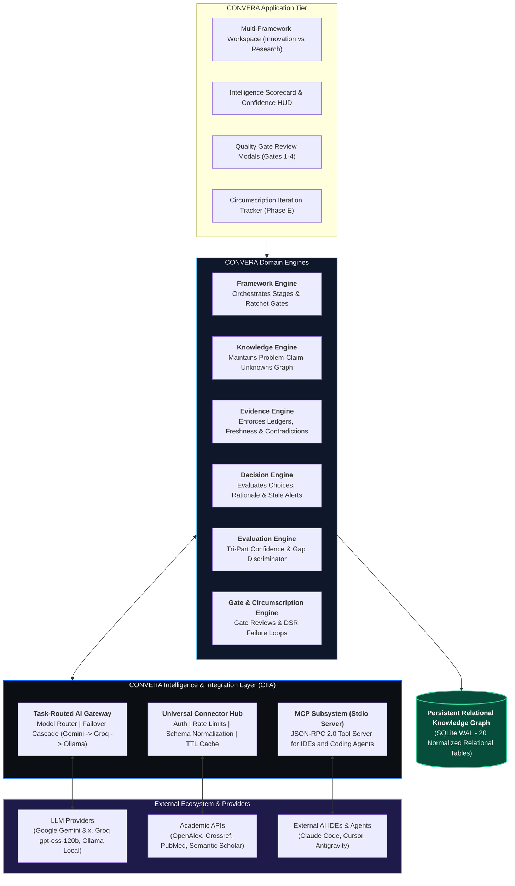
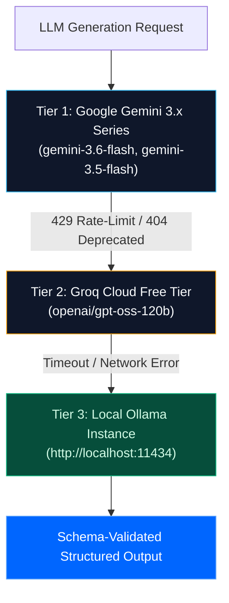

> [!WARNING]
> **SUPERSEDED / HISTORICAL BASELINE SPECIFICATION**
> This document is an early draft of the Intelligence & Integration Architecture.
> It has been **fully superseded and expanded** by the canonical ratified Phase 4 AI suite:
> - Master CIIA Specification: [`docs/04-ai/CIIA.md`](04-ai/CIIA.md)
> - Task-Routed Gateway & Prompts: [`docs/04-ai/AI_ARCHITECTURE.md`](04-ai/AI_ARCHITECTURE.md)
> - Socratic Governance & Constraints: [`docs/04-ai/AI_GOVERNANCE.md`](04-ai/AI_GOVERNANCE.md)
> - Scholarly Connectors: [`docs/04-ai/CONNECTOR_ARCHITECTURE.md`](04-ai/CONNECTOR_ARCHITECTURE.md)
> - Model Context Protocol: [`docs/04-ai/MCP.md`](04-ai/MCP.md)
>
> In accordance with **Constitution Article VII (Documentation Authority)**, the ratified modular documents take absolute precedence.


---

# CONVERA Intelligence & Integration Architecture (CIIA)

**Product:** CONVERA  
**Parent Brand:** EMAERX  
**Standard Alignment:** CONVERA Concept Development Standard (CCDS v2.0) | Model Context Protocol (MCP) | IEEE 830 / ISO 29148  
**Document Type:** Technical Systems, Integration Contract & MCP Interoperability Specification  
**Status:** Approved / Implementation Baseline  
**Version:** 2.1  

---

## 1. Executive Summary & Core Doctrines

The **CONVERA Intelligence & Integration Architecture (CIIA)** defines the formal architectural contract between the **CONVERA Core System** (Knowledge, Evidence, Framework, Decision, Evaluation, and Gate Engines) and the external intelligence ecosystem (Large Language Models, Academic APIs, Web Search, Document Parsers, MCP Tooling, and Cloud Accelerators).

CIIA is governed by two foundational doctrines:

> ### **Doctrine I: "External systems provide information and capabilities; CONVERA provides the persistent context, evidence structure, governance, and decision intelligence."**

> ### **Doctrine II: Free-First Sovereign Core + Controlled Acceleration.**  
> *Build CONVERA's core as a $0, provider-independent sovereign platform (SQLite WAL, Local Ollama / Free Groq / Free Gemini tier, open-access academic APIs), while supporting optional external cloud and tool integrations without hard runtime dependencies.*

```text
CONVERA CORE ($0 Required Baseline)
       │
┌──────┴────────────────────────────────────────────────────────────────────────┐
│ LOCAL FREE FIRST                                                              │
│   • Local LLM: Ollama (100% Local / Private)                                  │
│   • Free Tier LLM: Google Gemini 3.x series & Groq (openai/gpt-oss-120b)      │
│   • Persistence: Zero-Ops SQLite WAL (20 Normalized Relational Tables)        │
│   • Academic Search: OpenAlex, Crossref, PubMed, Semantic Scholar (Free APIs) │
│   • MCP Subsystem: JSON-RPC 2.0 Stdio Tool Server for IDEs and Agents        │
└───────────────────────────────────────────────────────────────────────────────┘
```

---

## 2. System Architecture & Boundaries



---

## 3. Task-Routed AI Gateway & Provider Cascades

The CIIA AI Gateway (`backend/llm_gateway.py`) orchestrates a 3-tier resilient provider cascade:



### Gateway Invariants:
1. **Zero Silent Failures:** 429 quota exhaustion or model deprecations automatically cascade to the next provider without crashing the user session.
2. **Structured Output Enforcement:** Pydantic models enforce schema parsing on all phase outputs.
3. **Decoupled Prompt Registry:** Prompts are organized symmetrically in `backend/prompts/` and loaded dynamically via `get_framework_prompt()`.

---

## 4. Universal Connector Hub & Direct Connectors

External scholarly search providers implement the `BaseConnector` abstract contract (`backend/connectors/base.py`):

```python
class BaseConnector(ABC):
    @property
    @abstractmethod
    def connector_id(self) -> str: pass

    @property
    @abstractmethod
    def display_name(self) -> str: pass

    @property
    @abstractmethod
    def capabilities(self) -> List[str]: pass

    @abstractmethod
    async def search(self, query: str, limit: int = 10, **kwargs) -> List[NormalizedScholarlyWork]: pass

    @abstractmethod
    async def fetch_by_id(self, identifier: str) -> Optional[NormalizedScholarlyWork]: pass

    @abstractmethod
    async def health_check(self) -> Dict[str, Any]: pass
```

### Implemented Active Connectors:
1. **OpenAlex Connector (`backend/connectors/openalex_connector.py`)**:
   - Queries OpenAlex scholarly graph for works, inverted index abstracts, citation metrics, and primary concept topics.
2. **Crossref Connector (`backend/connectors/crossref_connector.py`)**:
   - Resolves DOIs and retrieves peer-reviewed journal metadata and publication years.
3. **PubMed Connector (`backend/connectors/pubmed_connector.py`)**:
   - Interfaces with NCBI E-Utilities (`esearch.fcgi` + `esummary.fcgi`) for biomedical and health science literature.
4. **Semantic Scholar Connector (`backend/connectors/semanticscholar_connector.py`)**:
   - Queries Semantic Scholar Academic Graph for computing, CS, and AI papers with influential citation metrics.

---

## 5. Model Context Protocol (MCP) Server Subsystem

CONVERA provides a standalone Model Context Protocol server (`backend/mcp_server.py`) communicating via standard input / output (JSON-RPC 2.0 stdio):

### Exposed MCP Tools:
| Tool Name | Purpose | Parameters |
| :--- | :--- | :--- |
| `convera_query_knowledge` | Queries relational claims, epistemic states, and evidence links. | `project_id`, `problem_id` |
| `convera_query_unknowns` | Retrieves 3-column epistemic triangulation (Know, Think, Don't Know). | `project_id` |
| `convera_query_decisions` | Retrieves decision records, rationale, and stale review alerts. | `project_id` |
| `convera_calibrate_confidence` | Calculates Tri-Part Confidence ($AI 
eq Evidence 
eq Decision$) & overconfidence warnings. | `ai_model_confidence`, `evidence_items`, `risk_level` |
| `convera_discriminate_gap` | Classifies statements into Authentic Research Gap vs Study Limitation vs Premature Solution. | `statement` |
| `convera_trace_requirement` | Traces end-to-end requirement lineage ($P 	o C 	o E 	o D 	o R$). | `requirement_id` |
| `convera_search_literature` | Concurrent federated search across OpenAlex, Crossref, PubMed, and Semantic Scholar. | `query`, `limit` |

---

## 6. Security Posture & Integration Invariants

1. **SQL Security:** All database access paths use parameterized queries (`?` placeholders).
2. **Network Whitelisting:** External HTTP client restricts outbound calls strictly to verified academic and LLM endpoints.
3. **Sovereign Local Operation:** System functions with 100% autonomy without requiring third-party cloud infrastructure.
