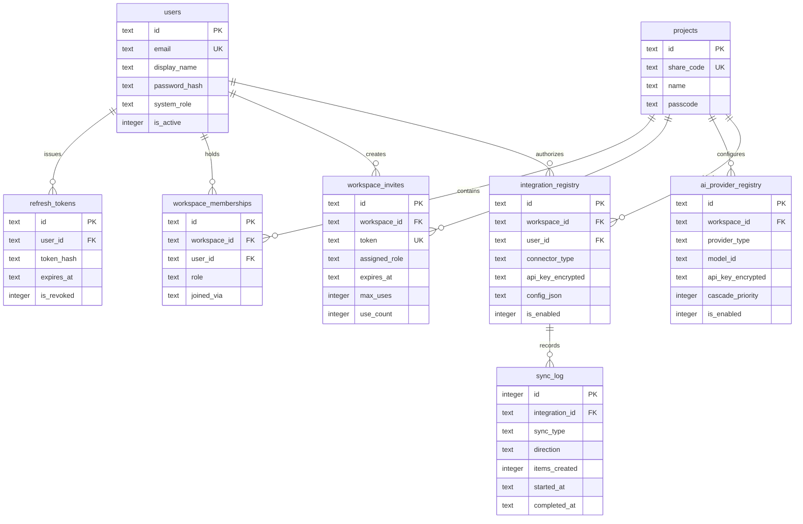

# Data Model Specification: Feature 012

**Feature**: `012-tool-integrations-and-progressive-identity`  
**Classification**: SQLite WAL Relational Schema Extension (Additive)  
**Database Authority**: SQLite 3 with Write-Ahead Logging (WAL)  
**Storage Port**: `BaseStorageAdapter` (`backend/storage/base.py`)  
**Adapter Implementation**: `SQLiteStorageAdapter` (`backend/storage/sqlite_adapter.py`)

---

## 1. Schema Expansion Overview

CONVERA currently operates with 24 relational tables. Feature 012 adds **7 new tables** without mutating or removing any existing column or table, preserving 100% backward compatibility:

```text
Existing Core Tables (Untouched: 24 Tables):
  projects, project_members, sessions, session_snapshots,
  problems, problem_sources, problem_phase_history, problem_claims,
  problem_assumptions, problem_alternatives, decision_records,
  problem_comments, mentor_signoffs, claim_evidence_links,
  assumption_validation_tests, impact_invalidation_events, evidence_provenance,
  claim_contradictions, project_unknowns, requirements_traceability,
  gate_reviews, research_domains, circumscription_iterations, literature_evidence

New Additive Extension Tables (7 Tables):
  1. users                    - Persistent user identity and credentials
  2. refresh_tokens           - Cryptographic rotating session refresh tokens
  3. workspace_memberships    - Granular user-to-workspace RBAC bindings
  4. workspace_invites        - Cryptographic single/multi-use invite tokens
  5. ai_provider_registry     - Dynamic, workspace-scoped AI provider cascade
  6. integration_registry     - External tool connector configurations (Zotero, Notion, etc.)
  7. sync_log                 - Immutable ingestion and synchronization audit log
```

---

## 2. Table Definitions & Constraints

### 2.1 Table: `users`
Represents an authenticated human user in the CONVERA ecosystem.

| Column | Type | Constraints | Description |
|:---|:---|:---|:---|
| `id` | `TEXT` | `PRIMARY KEY` | UUID v4 with prefix (`usr_...`) |
| `email` | `TEXT` | `UNIQUE NOT NULL` | Verified login email (case-insensitive indexed) |
| `display_name` | `TEXT` | `NOT NULL` | Human-readable user name (e.g., "Dr. Maria Santos") |
| `password_hash` | `TEXT` | `NOT NULL` | Argon2id cryptographic hash string |
| `avatar` | `TEXT` | `DEFAULT '👩‍💻'` | Unicode emoji or avatar asset URI |
| `system_role` | `TEXT` | `NOT NULL DEFAULT 'USER'` | `SUPERADMIN` or `USER` |
| `is_active` | `INTEGER` | `DEFAULT 1` | Soft-disable flag (1 = active, 0 = disabled) |
| `preferences_json`| `TEXT` | `DEFAULT '{}'` | Serialized UI settings, theme, notifications |
| `last_login_at` | `TEXT` | `NULLABLE` | ISO-8601 UTC timestamp of last authentication |
| `created_at` | `TEXT` | `DEFAULT (datetime('now'))` | Timestamp of account creation |
| `updated_at` | `TEXT` | `DEFAULT (datetime('now'))` | Timestamp of last profile update |

---

### 2.2 Table: `refresh_tokens`
Tracks rotating session refresh tokens.

| Column | Type | Constraints | Description |
|:---|:---|:---|:---|
| `id` | `TEXT` | `PRIMARY KEY` | UUID v4 (`rtk_...`) |
| `user_id` | `TEXT` | `NOT NULL, FK -> users(id) ON DELETE CASCADE` | Associated user |
| `token_hash` | `TEXT` | `NOT NULL` | SHA-256 hash of the issued opaque refresh token |
| `expires_at` | `TEXT` | `NOT NULL` | ISO-8601 UTC expiry timestamp (7 days) |
| `device_info` | `TEXT` | `NULLABLE` | User-Agent or device fingerprint for audit |
| `is_revoked` | `INTEGER` | `DEFAULT 0` | Revocation flag (1 = revoked) |
| `created_at` | `TEXT` | `DEFAULT (datetime('now'))` | Timestamp of token issuance |

**Indexes**:
- `CREATE INDEX idx_refresh_tokens_user ON refresh_tokens(user_id);`
- `CREATE INDEX idx_refresh_tokens_hash ON refresh_tokens(token_hash);`

---

### 2.3 Table: `workspace_memberships`
Binds users to workspaces (`projects.id`) with specific RBAC privileges.

| Column | Type | Constraints | Description |
|:---|:---|:---|:---|
| `id` | `TEXT` | `PRIMARY KEY` | UUID v4 (`wsm_...`) |
| `workspace_id` | `TEXT` | `NOT NULL, FK -> projects(id) ON DELETE CASCADE` | Associated workspace |
| `user_id` | `TEXT` | `NULLABLE, FK -> users(id) ON DELETE SET NULL` | Linked user (NULL for anonymous collaborators) |
| `role` | `TEXT` | `NOT NULL DEFAULT 'MEMBER'` | `OWNER`, `ADMIN`, `MEMBER`, `ADVISOR`, `VIEWER` |
| `display_name` | `TEXT` | `NULLABLE` | Denormalized display name for rapid listing |
| `invited_by` | `TEXT` | `NULLABLE, FK -> users(id)` | User who invited this member |
| `joined_via` | `TEXT` | `DEFAULT 'SHARE_CODE'` | `SHARE_CODE`, `INVITE_LINK`, `DIRECT_ASSIGN` |
| `is_active` | `INTEGER` | `DEFAULT 1` | 1 = active, 0 = removed |
| `last_active_at`| `TEXT` | `NULLABLE` | Timestamp of last workspace interaction |
| `created_at` | `TEXT` | `DEFAULT (datetime('now'))` | Join timestamp |
| `updated_at` | `TEXT` | `DEFAULT (datetime('now'))` | Timestamp of last role update |

**Constraints & Indexes**:
- `UNIQUE(workspace_id, user_id)` (One membership per registered user per workspace)
- `CREATE INDEX idx_ws_memberships_workspace ON workspace_memberships(workspace_id);`
- `CREATE INDEX idx_ws_memberships_user ON workspace_memberships(user_id);`

---

### 2.4 Table: `workspace_invites`
Cryptographic invite tokens for governed workspace access.

| Column | Type | Constraints | Description |
|:---|:---|:---|:---|
| `id` | `TEXT` | `PRIMARY KEY` | UUID v4 (`inv_...`) |
| `workspace_id` | `TEXT` | `NOT NULL, FK -> projects(id) ON DELETE CASCADE` | Target workspace |
| `token` | `TEXT` | `UNIQUE NOT NULL` | Cryptographically random 32-byte string (`INV-...`) |
| `invited_email` | `TEXT` | `NULLABLE` | Optional restriction to a specific email address |
| `assigned_role` | `TEXT` | `NOT NULL DEFAULT 'MEMBER'` | Role granted upon redemption |
| `invited_by_user_id`| `TEXT` | `NULLABLE, FK -> users(id) ON DELETE SET NULL` | Creator of the invite |
| `max_uses` | `INTEGER` | `DEFAULT 1` | Maximum redemptions allowed (1 = single use) |
| `use_count` | `INTEGER` | `DEFAULT 0` | Number of times redeemed |
| `expires_at` | `TEXT` | `NOT NULL` | Expiry timestamp (default +48 hours) |
| `is_revoked` | `INTEGER` | `DEFAULT 0` | Manual revocation flag |
| `created_at` | `TEXT` | `DEFAULT (datetime('now'))` | Generation timestamp |

**Indexes**:
- `CREATE INDEX idx_ws_invites_token ON workspace_invites(token);`
- `CREATE INDEX idx_ws_invites_workspace ON workspace_invites(workspace_id);`

---

### 2.5 Table: `ai_provider_registry`
Dynamic, database-backed registry of LLM providers with encrypted credentials.

| Column | Type | Constraints | Description |
|:---|:---|:---|:---|
| `id` | `TEXT` | `PRIMARY KEY` | Unique provider ID (`gemini`, `groq`, `ollama_local`) |
| `workspace_id` | `TEXT` | `NULLABLE, FK -> projects(id) ON DELETE CASCADE` | NULL = system default, Set = workspace override |
| `display_name` | `TEXT` | `NOT NULL` | Human-friendly name (e.g., "Google Gemini 2.5 Flash") |
| `provider_type` | `TEXT` | `NOT NULL` | `FREE_CLOUD`, `LOCAL`, `PAID_CLOUD` |
| `base_url` | `TEXT` | `NULLABLE` | Endpoint URL (e.g., `http://ollama:11434/v1`) |
| `api_key_encrypted`| `TEXT` | `NULLABLE` | Fernet-encrypted API key string |
| `model_id` | `TEXT` | `NOT NULL` | Model name identifier (`llama3.2:3b`, `gemini-2.5-flash`) |
| `is_enabled` | `INTEGER` | `DEFAULT 1` | 1 = enabled in cascade, 0 = disabled |
| `cascade_priority` | `INTEGER` | `DEFAULT 99` | Cascade rank order (1 = highest priority) |
| `max_tokens` | `INTEGER` | `DEFAULT 8192` | Context/completion token limit |
| `temperature` | `REAL` | `DEFAULT 0.7` | Sampling temperature |
| `last_health_check_at`| `TEXT` | `NULLABLE` | Timestamp of last probe |
| `last_health_status` | `TEXT` | `NULLABLE` | `HEALTHY`, `DEGRADED`, `UNREACHABLE` |
| `config_json` | `TEXT` | `DEFAULT '{}'` | Additional provider-specific parameters |
| `created_at` | `TEXT` | `DEFAULT (datetime('now'))` | Creation timestamp |
| `updated_at` | `TEXT` | `DEFAULT (datetime('now'))` | Last modification timestamp |

---

### 2.6 Table: `integration_registry`
Connects external tools (Zotero, Notion, Hypothesis, ORCID) to workspaces.

| Column | Type | Constraints | Description |
|:---|:---|:---|:---|
| `id` | `TEXT` | `PRIMARY KEY` | Integration ID (`zotero_ws1`, `notion_ws1`) |
| `workspace_id` | `TEXT` | `NOT NULL, FK -> projects(id) ON DELETE CASCADE` | Associated workspace |
| `user_id` | `TEXT` | `NULLABLE, FK -> users(id) ON DELETE SET NULL` | Authorizing user |
| `display_name` | `TEXT` | `NOT NULL` | Label (e.g., "Lab Shared Zotero Library") |
| `connector_type`| `TEXT` | `NOT NULL` | `REFERENCE`, `KNOWLEDGE`, `ANNOTATION`, `IDENTITY` |
| `api_key_encrypted`| `TEXT` | `NULLABLE` | Fernet-encrypted Integration Token or API Key |
| `config_json` | `TEXT` | `NOT NULL DEFAULT '{}'` | Settings (library ID, database ID, collection paths) |
| `is_enabled` | `INTEGER` | `DEFAULT 0` | 1 = active, 0 = disabled |
| `last_sync_at` | `TEXT` | `NULLABLE` | Timestamp of last successful sync |
| `last_sync_status` | `TEXT` | `NULLABLE` | `SUCCESS`, `PARTIAL_FAILURE`, `FAILED` |
| `items_synced_count`| `INTEGER` | `DEFAULT 0` | Cumulative total of ingested items |
| `sync_interval_minutes`| `INTEGER`| `DEFAULT 0` | 0 = manual only, >0 = periodic background sync |
| `created_at` | `TEXT` | `DEFAULT (datetime('now'))` | Creation timestamp |
| `updated_at` | `TEXT` | `DEFAULT (datetime('now'))` | Modification timestamp |

---

### 2.7 Table: `sync_log`
Immutable audit log recording data synchronization events.

| Column | Type | Constraints | Description |
|:---|:---|:---|:---|
| `id` | `INTEGER` | `PRIMARY KEY AUTOINCREMENT` | Auto-incrementing log ID |
| `integration_id`| `TEXT` | `NOT NULL, FK -> integration_registry(id) ON DELETE CASCADE` | Target integration |
| `workspace_id` | `TEXT` | `NULLABLE` | Denormalized workspace ID |
| `sync_type` | `TEXT` | `NOT NULL` | `PULL`, `PUSH`, `FULL_SYNC` |
| `direction` | `TEXT` | `NOT NULL` | `INBOUND` or `OUTBOUND` |
| `items_processed`| `INTEGER`| `DEFAULT 0` | Total records scanned |
| `items_created`| `INTEGER` | `DEFAULT 0` | New items inserted into evidence/source tables |
| `items_updated`| `INTEGER` | `DEFAULT 0` | Existing items updated |
| `items_failed` | `INTEGER` | `DEFAULT 0` | Errored items |
| `error_message`| `TEXT` | `NULLABLE` | Exception message or diagnostic trace |
| `started_at` | `TEXT` | `NOT NULL` | Synchronization start timestamp |
| `completed_at` | `TEXT` | `NULLABLE` | Completion timestamp |
| `duration_ms` | `INTEGER` | `NULLABLE` | Execution latency in milliseconds |

---

## 3. Entity Relationship Topology


