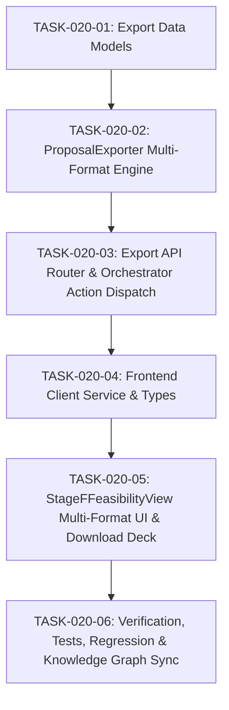

# CONVERA SDD-020: Work Breakdown Structure & Tasks
# DSR Deliverable & Comprehensive Proposal Export Engine (Phase D1)

**Specification ID**: CONVERA-SDD-020  
**Feature Title**: DSR Deliverable & Comprehensive Proposal Export Engine  
**Authority Tier**: Tier 2 (Engineering Execution Plan)  
**Governing Standard**: CCDS v2.0, Constitution Articles I, II, IV, VII, VIII  
**Target Feature Branch**: `feature/020-dsr-deliverable-proposal-export`  
**Target Integration Branch**: `develop`  
**Baseline Git Commit**: `32d70a5`  

---

## 1. Task Dependency Graph

---

## 2. Detailed Task Breakdown

### TASK-020-01: Export Data Models [x]
- **Target File**: `backend/models/export.py`
- **Scope**:
  - [x] Define `ExportFormat` enum: `MARKDOWN`, `LATEX`, `BIBTEX`, `HTML`, `JSON`, `BUNDLE`.
  - [x] Define `ProposalSection` enum with all 8 core sections + bibliography.
  - [x] Define `DSRProposalCompilationRequest` and `DSRProposalCompilationResponse`.
  - [x] Verify Pydantic validation rules and defaults.

### TASK-020-02: ProposalExporter Multi-Format Compilation Engine [x]
- **Target File**: `backend/engines/proposal_exporter.py`
- **Scope**:
  - [x] Query Table 36 critiques (`storage.list_critique_records`) and integrate Section 7: Cross-Stage Critique & Blind-Spot Audit.
  - [x] Implement `_compile_latex`: Generates compilable `.tex` file with standard packages, math equations, `booktabs` tables, and `\cite{...}` citations.
  - [x] Implement `_compile_bibtex`: Generates valid BibTeX `.bib` database from active `scholarly_works` and linked sources.
  - [x] Implement `_compile_html`: Generates standalone HTML document with embedded responsive styles and `@media print` rules for browser PDF printing.
  - [x] Implement `_compile_json`: Generates complete JSON tree of monograph sections and raw records.
  - [x] Implement `_compute_provenance_hash`: Computes SHA-256 digest of canonical relational records and embeds in all formats.
  - [x] Implement unified `compile_proposal` method handling all formats and bundle packaging.

### TASK-020-03: Export API Router & Orchestrator Action Dispatch [x]
- **Target Files**:
  - `backend/routers/export.py`
  - `backend/models/orchestrator.py`
  - `backend/services/research_orchestrator.py`
- **Scope**:
  - [x] Update `GET /api/export/dsr-proposal` to accept `format`, `session_id`, `problem_id`.
  - [x] Add `POST /api/export/compile` accepting `DSRProposalCompilationRequest`.
  - [x] Add `GET /api/export/bibtex` for direct `.bib` download.
  - [x] Add `EXPORT_PROPOSAL` to `ActionType` in `backend/models/orchestrator.py`.
  - [x] Wire action dispatch in `ResearchOrchestrator` to invoke `ProposalExporter.compile_proposal()`.

### TASK-020-04: Frontend Client Service & Types [x]
- **Target Files**:
  - `web/src/types/export.ts`
  - `web/src/services/exportService.ts`
- **Scope**:
  - [x] Define TypeScript types: `ExportFormat`, `DSRProposalCompilationRequest`, `DSRProposalCompilationResponse`.
  - [x] Author client service methods: `compileProposal`, `fetchProposalExport`, `downloadBibtex`.

### TASK-020-05: StageFFeasibilityView Multi-Format UI & Download Deck [x]
- **Target File**: `web/src/components/research/feasibility/StageFFeasibilityView.tsx`
- **Scope**:
  - [x] Replace single-markdown toolbar in TAB 4 with format selector pills: `MARKDOWN (.md)`, `LATEX (.tex)`, `BIBTEX (.bib)`, `PRINTABLE HTML (.html)`, `PROVENANCE JSON (.json)`.
  - [x] Update preview container to display format-specific preview with mono typography and scroll preservation.
  - [x] Implement "Print / Save PDF" browser trigger for the HTML view (`window.print()`).
  - [x] Implement "Download Active Format" triggering browser blob download with appropriate MIME type and extension (`.md`, `.tex`, `.bib`, `.html`, `.json`).
  - [x] Add "Copy to Clipboard" with visual check feedback.

### TASK-020-06: Verification, Tests, Regression & Knowledge Graph Sync [x]
- **Target Files**:
  - `backend/tests/test_proposal_exporter.py`
  - `specs/020-dsr-deliverable-proposal-export/checklist.md`
  - `specs/020-dsr-deliverable-proposal-export/audit-trail.md`
- **Scope**:
  - [x] Write dedicated test suite `backend/tests/test_proposal_exporter.py` covering:
    - [x] Markdown generation with Section 7 Critique synthesis.
    - [x] LaTeX syntax validation and BibTeX citation key integrity.
    - [x] HTML generation with `@media print` rules.
    - [x] Deterministic SHA-256 provenance hash generation.
    - [x] API router endpoints (`GET /api/export/dsr-proposal`, `POST /api/export/compile`, `GET /api/export/bibtex`).
    - [x] Orchestrator action dispatch for `EXPORT_PROPOSAL`.
  - [x] Run full backend regression suite (`pytest backend/tests/ -m "not live"`).
  - [x] Run frontend typecheck (`npm run typecheck --prefix web`) and build (`npm run build --prefix web`).
  - [x] Sync knowledge graph via `graphify update .`.
